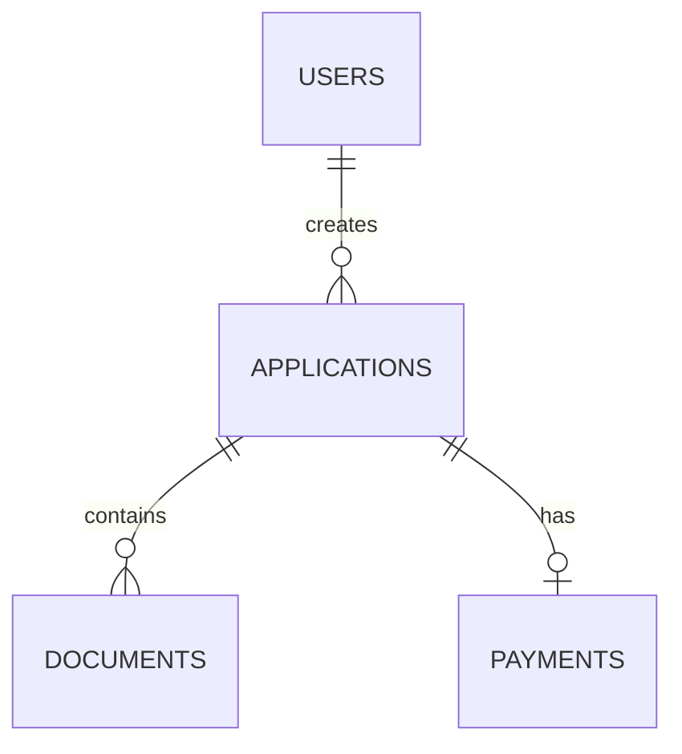

# AI Coding Agent — Project Context Documentation Generator

## Purpose

You are working on an **existing software project**. Your first responsibility is to create a compact but comprehensive Markdown document that gives another coding agent (Kimi, ChatGPT, Gemini, Claude, Copilot, etc.) a reliable understanding of the project **without requiring that agent to repeatedly browse the entire codebase**.

The final documentation file should act as the project's **AI-readable source of truth / project map**.

Do not guess. Every important technical fact must be verified from the actual codebase, configuration, database schema/migrations, routes, tests, documentation, and deployment configuration.

---

# 1. Primary Objective

Inspect the project systematically and create:

```text
AGENT_CONTEXT.md
```

This file must explain:

- What the software is
- Why it exists
- Who uses it
- Main business workflows
- User roles and privileges
- Authentication and authorization
- Database architecture
- Important database tables and relationships
- Backend architecture
- Frontend/mobile architecture
- Important modules/features
- Routes and APIs
- Important services/classes/components
- File/folder responsibilities
- Data flow
- Payment flow, where applicable
- Notifications, where applicable
- Scheduled jobs/cron tasks
- Queues/background jobs
- File uploads/storage
- External APIs/integrations
- Configuration
- Deployment architecture
- Development environment
- Testing
- Known bugs/issues
- Important technical decisions
- Security rules
- Business rules
- Common pitfalls
- Current development status
- Safe instructions for future coding agents

The documentation must optimize for **high information density**. Another AI should be able to read the document first and understand the project before opening individual source files.

---

# 2. Critical Rule: Do Not Guess

Never invent:

- Tables
- Columns
- Roles
- Permissions
- API endpoints
- Routes
- Features
- Business rules
- Relationships
- Environment variables
- External services
- Scheduled jobs
- File locations
- Authentication mechanisms
- Deployment details
- Framework versions
- Package versions
- Configuration
- Intended behavior

If something cannot be verified, explicitly write:

> **Unknown / Not verified**

If the code contains conflicting implementations, document the conflict and identify the actual/current implementation as accurately as possible.

---

# 3. How to Inspect the Project

Do not randomly browse files.

Use a structured discovery process.

## Phase A — Project Identification

Inspect:

```text
README*
composer.json
package.json
pubspec.yaml
requirements.txt
pyproject.toml
Pipfile
Gemfile
go.mod
Cargo.toml
docker-compose*
Dockerfile*
.env.example
.gitignore
```

and any other obvious project metadata.

Determine:

- Project name
- Framework
- Programming languages
- Runtime versions
- Package manager
- Major dependencies
- Application type
- Backend/frontend/mobile structure
- Entry points

---

# 4. Repository Structure

Create a concise tree showing important directories.

Example:

```text
project/
├── app/
│   ├── Models/
│   ├── Services/
│   ├── Http/
│   └── ...
├── database/
│   ├── migrations/
│   └── seeders/
├── routes/
├── resources/
├── tests/
└── ...
```

Do not dump the entire repository tree.

Only include directories and files that matter to understanding the application.

For every important directory explain:

```text
Path:
Purpose:
Important files:
```

---

# 5. Application Overview

Document:

## Product

Explain in plain language:

- What the application does
- The problem it solves
- The main users
- The main workflow
- What makes the system different from a simple CRUD application

## High-Level Architecture

Describe:

```text
User
 ↓
Frontend / Mobile App
 ↓
API / Web Routes
 ↓
Controllers / Actions
 ↓
Services / Business Logic
 ↓
Models / Repositories
 ↓
Database
```

Adapt this diagram to the actual architecture.

If there are multiple applications, document them separately.

---

# 6. Features / Modules

Create a module inventory.

For every major feature:

```markdown
## Module: [Name]

### Purpose
What this module does.

### Users
Which roles can access it.

### Main Workflow
1. ...
2. ...
3. ...

### Important Files
- `path/to/file`
- `path/to/file`

### Database
- table
- table

### Routes / APIs
- `GET ...`
- `POST ...`

### Business Rules
- ...

### Dependencies
- ...

### Known Issues
- ...
```

Include all important modules.

Do not describe trivial utility files individually.

---

# 7. User Roles and Privileges

This section is extremely important.

Determine roles from the actual code.

Inspect:

- Authentication code
- Middleware
- Gates
- Policies
- Permissions
- Role models
- Spatie Permission or similar packages
- Route middleware
- Controllers
- UI conditionals
- Database seeders
- Admin configuration

Create:

```markdown
# Roles & Privileges

## Role: Administrator

### Can
- ...

### Cannot
- ...

### Accessible Modules
- ...

### Important Restrictions
- ...

## Role: Staff

...
```

Also create a permission matrix where useful:

| Feature | Admin | Staff | Student | Other |
|---|---:|---:|---:|---:|
| View | ✓ | ✓ | ✓ | |
| Create | ✓ | ✓ | | |
| Update | ✓ | ✓ | | |
| Delete | ✓ | | | |
| Approve | ✓ | | | |

Use the actual project roles. Do not assume these example roles exist.

Document:

- Role hierarchy
- Permission inheritance
- Special-case permissions
- Ownership restrictions
- Approval permissions
- Administrative privileges
- API permissions
- Mobile permissions
- Any role-specific UI restrictions

---

# 8. Authentication & Authorization

Document exactly how authentication works.

Determine:

- Login mechanism
- Registration
- Password reset
- Email verification
- OTP
- 2FA
- Session authentication
- Token authentication
- Sanctum
- Passport
- JWT
- OAuth
- Social login
- API tokens
- Session expiration
- Logout
- Middleware
- Policies
- Gates
- Permissions

Explain the authentication flow.

Example:

```text
Login
 ↓
Credentials validated
 ↓
User authenticated
 ↓
Token/session created
 ↓
Frontend stores authentication state
 ↓
Requests include authentication
 ↓
Middleware verifies user
 ↓
Authorization checks permission
```

Adapt to the actual application.

---

# 9. Database Documentation

This is one of the highest-priority sections.

Inspect:

- Migrations
- Models
- Relationships
- Seeders
- Factories
- Raw SQL
- Database configuration
- Foreign keys
- Unique constraints
- Indexes
- Enums
- Pivot tables

Create a database overview.

## Tables

For each important table:

```markdown
## `users`

### Purpose
Stores application users.

### Important Columns

| Column | Type | Nullable | Default | Meaning |
|---|---|---|---|---|
| id | ... | ... | ... | ... |
| ... | ... | ... | ... | ... |

### Relationships
- hasMany(...)
- belongsTo(...)
- belongsToMany(...)

### Important Constraints
- unique(...)
- foreign key(...)
- ...

### Used By
- Authentication
- ...
```

Do this for all important tables.

For very large systems, group related tables while still documenting every important table.

---

# 10. Database Relationship Map

Create a compact relationship diagram.

Example:

```text
users
 ├── hasMany applications
 ├── hasMany payments
 └── belongsTo role

applications
 ├── belongsTo user
 ├── hasMany documents
 └── hasOne payment
```

If useful, include Mermaid:



Only include relationships verified from the code.

---

# 11. Important Business Rules

Extract rules from:

- Validation
- Services
- Controllers
- Models
- Policies
- Database constraints
- UI logic
- Tests

Document rules such as:

```markdown
### Application Submission Rule

An application cannot be submitted until:
1. Required personal information exists.
2. Required documents are uploaded.
3. Payment has been confirmed.
4. ...
```

Do not merely describe code.

Explain the **business meaning** of the code.

---

# 12. Main Workflows

Document end-to-end workflows.

Examples:

```text
User Registration
       ↓
Profile Completion
       ↓
Application Creation
       ↓
Document Upload
       ↓
Payment
       ↓
Payment Verification
       ↓
Submission
       ↓
Review
       ↓
Approval / Rejection
```

For each workflow document:

- Trigger
- Actor
- Steps
- Database changes
- API calls
- External services
- Notifications
- Validation
- Failure conditions
- Final state

Include important alternate flows.

---

# 13. API Documentation

Inspect:

```text
routes/api.php
routes/web.php
routes/*.php
Controllers
Form Requests
API Resources
```

Create a concise API map.

```markdown
## Authentication

| Method | Endpoint | Purpose | Auth |
|---|---|---|---|
| POST | `/api/login` | Login | No |
| POST | `/api/logout` | Logout | Yes |

## Applications

| Method | Endpoint | Purpose | Auth |
|---|---|---|---|
| GET | `/api/applications` | List applications | Yes |
| POST | `/api/applications` | Create application | Yes |
```

Do not invent endpoints.

Document important request parameters, validation rules, response structure, and authorization requirements.

---

# 14. Frontend / Mobile Application

If the project has a frontend or mobile application, document:

- Framework
- Navigation
- Screens/pages
- Components
- State management
- API client
- Authentication state
- Local storage
- Form handling
- Error handling
- File uploads
- Push notifications
- Deep links
- Environment configuration

For each important screen:

```markdown
## Screen: Login

Path:
Purpose:
Accessible By:
API Calls:
State:
Important Components:
Navigation After Success:
Known Issues:
```

---

# 15. Backend Architecture

Document:

- Controllers
- Services
- Actions
- Models
- Repositories
- Events
- Listeners
- Jobs
- Notifications
- Observers
- Policies
- Middleware
- Form Requests
- Resources
- Commands

Explain **where business logic belongs**.

Example:

```text
Controller
    ↓
Form Request
    ↓
Service
    ↓
Model
    ↓
Database
```

Identify important architectural conventions used by the existing project.

Future coding agents must follow the existing architecture rather than introducing unnecessary patterns.

---

# 16. Payments

If payments exist, document:

- Payment provider
- Initialization
- Payment reference
- Callback
- Webhook
- Verification
- Database records
- Successful payment state
- Failed payment state
- Duplicate-payment protection
- Refund handling
- Receipt generation

Create the actual payment flow.

Example:

```text
Create Payment
 ↓
Payment Provider
 ↓
Customer Pays
 ↓
Callback/Webhook
 ↓
Verify Transaction
 ↓
Update Payment
 ↓
Update Business Record
 ↓
Generate Receipt
```

---

# 17. File Uploads and Storage

Document:

- Upload locations
- Storage disks
- Public/private files
- Symlinks
- File naming
- Validation
- Allowed extensions
- Maximum sizes
- Database references
- Download authorization
- Deletion behavior
- Backup considerations

Clearly distinguish:

```text
Database record
vs
Physical file
```

Explain what happens when a file is replaced or deleted.

---

# 18. External Services / Integrations

Find every external integration.

For each:

```markdown
## Integration: [Service]

Purpose:
Used By:
Authentication:
Environment Variables:
Endpoints:
Request Flow:
Response Handling:
Failure Handling:
Important Files:
```

Examples may include:

- Payment gateways
- Email providers
- SMS providers
- Maps/geolocation APIs
- Cloud storage
- CDN
- Video providers
- Authentication providers
- Government APIs

Only document integrations actually present.

**Never copy real API keys, passwords, tokens, secrets, or credentials into AGENT_CONTEXT.md.**

Use:

```text
PAYMENT_API_KEY=<configured in environment>
```

not the actual value.

---

# 19. Scheduled Tasks / Cron / Queues

Inspect:

- Console commands
- Scheduler
- Queue jobs
- Workers
- Cron configuration
- Supervisor
- systemd
- Hosting control panel configuration
- GitHub Actions
- deployment scripts

Document:

```markdown
## Scheduled Tasks

| Task | Schedule | Purpose | Important Files |
|---|---|---|---|
| ... | ... | ... | ... |
```

Also document queue workers and important background jobs.

---

# 20. Configuration & Environment

Document important environment variables **without their secrets**.

Example:

```text
APP_ENV
APP_URL
DB_CONNECTION
DB_HOST
DB_DATABASE
MAIL_MAILER
PAYMENT_SECRET_KEY
```

For each important variable explain:

- Purpose
- Required/optional
- Where it is used

Do not expose secret values.

---

# 21. Deployment

Document the actual deployment architecture.

Include:

- Hosting provider
- Server
- Web server
- PHP/Python/Node/etc. version
- Database server
- Domain/subdomain
- Document root
- Application root
- Storage
- Symlinks
- SSL
- Queue workers
- Cron jobs
- Deployment process
- Cache
- Config cache
- Storage linking
- Permissions

Example:

```text
Internet
   ↓
Domain
   ↓
Web Server
   ↓
Public Directory
   ↓
Application
   ↓
Database
```

Do not include passwords or private credentials.

---

# 22. Development Setup

Document the minimum steps required for a new developer/AI agent to understand and run the project.

Include:

```bash
git clone ...
cd ...
install dependencies
configure environment
create database
run migrations
seed database
start development server
```

Only provide commands verified against the project.

Also document:

- Required software
- Runtime versions
- Local domains
- Required services
- Queue workers
- Frontend/mobile commands
- Testing commands

---

# 23. Testing

Inspect:

- PHPUnit
- Pest
- Jest
- Vitest
- Cypress
- Playwright
- Flutter tests
- React Native tests
- Python tests
- Feature tests
- Unit tests

Document:

- How tests are run
- What important workflows are covered
- Important test users/accounts if applicable
- Known missing test coverage

Never include real credentials.

---

# 24. Important Files

Create a section like:

```markdown
# Important Files

| File | Why It Matters |
|---|---|
| `...` | Application entry point |
| `...` | Authentication |
| `...` | Main business logic |
| `...` | Payment handling |
| `...` | Database model |
```

Prioritize files that a coding agent is likely to need.

---

# 25. Code Navigation Map

Create a "where to look" section.

Example:

```markdown
## If you need to change...

### Authentication
Look at:
- ...

### User permissions
Look at:
- ...

### Applications
Look at:
- ...

### Payments
Look at:
- ...

### File uploads
Look at:
- ...

### Notifications
Look at:
- ...

### Database
Look at:
- ...
```

This is extremely important because it reduces unnecessary repository searching.

---

# 26. Known Problems

Document known issues.

For each:

```markdown
## Issue: [Short Name]

### Symptoms
...

### Cause
...

### Current Workaround
...

### Relevant Files
...

### Status
Open / Investigating / Fixed
```

Do not claim an issue is fixed unless verified.

---

# 27. Technical Decisions

Document important decisions that future agents must respect.

Examples:

```markdown
## Decision: Existing Service Layer

Business logic is handled through services.

Future code should follow this pattern instead of moving business logic into controllers.
```

Include:

- Architecture decisions
- Database decisions
- Authentication decisions
- Storage decisions
- API conventions
- Naming conventions
- UI conventions
- Deployment decisions

---

# 28. Do Not Break These Rules

Create a section containing project-specific constraints discovered from the codebase.

Examples:

```markdown
- Do not change the database schema without checking dependent code.
- Do not remove existing fields simply because they appear unused.
- Do not change authentication middleware without checking mobile/API clients.
- Do not expose private uploaded files.
- Do not commit environment secrets.
- Do not replace an existing service pattern unnecessarily.
```

Only include rules that are justified by the project.

---

# 29. Current Project State

Create:

```markdown
# Current State

## Completed
- ...

## In Progress
- ...

## Planned
- ...

## Known Bugs
- ...

## Technical Debt
- ...
```

Use evidence from:

- TODO comments
- Issues
- README
- recent commits
- unfinished code
- disabled features
- tests
- project documentation

Do not confuse an old TODO with an active requirement unless verified.

---

# 30. AI Coding Instructions

End the document with instructions for future coding agents.

Use this structure:

```markdown
# Instructions for AI Coding Agents

Before modifying code:

1. Read this file completely.
2. Identify the relevant module.
3. Check the referenced files.
4. Understand the existing workflow.
5. Check database relationships and permissions.
6. Check whether the change affects API/mobile/frontend consumers.
7. Make the smallest safe change.
8. Preserve existing architecture and conventions.
9. Run relevant tests.
10. Report files changed and why.

## Important

Do not:
- invent architecture
- duplicate existing services
- bypass authorization
- expose secrets
- modify unrelated features
- perform destructive database operations without explicit instruction
- silently change business rules
```

---

# 31. Documentation Quality Requirements

The generated `AGENT_CONTEXT.md` must be:

### Accurate
Everything important must be verified.

### Compact
Do not paste large source files into the documentation.

### Navigable
Use headings, tables, diagrams, and file paths.

### Practical
A coding agent should know where to look when making a change.

### Current
Include a documentation metadata section:

```markdown
# Documentation Metadata

Last Audited:
Git Commit:
Project Version:
Documentation Version:
Generated By:
```

Use the actual commit/version when available.

---

# 32. What NOT to Put in the Documentation

Never include:

- Passwords
- API secrets
- Private keys
- Authentication tokens
- Database passwords
- Personal access tokens
- Private certificates
- Production credentials
- Sensitive personal data

Use placeholders such as:

```text
<SECRET>
<CONFIGURED_IN_ENV>
<PRODUCTION_VALUE>
```

---

# 33. Recommended Final AGENT_CONTEXT.md Structure

The final generated file should approximately follow this order:

```text
1. Documentation Metadata
2. Project Overview
3. Technology Stack
4. Architecture
5. Repository Structure
6. Modules / Features
7. User Roles & Privileges
8. Authentication & Authorization
9. Business Rules
10. Main Workflows
11. Database Architecture
12. Database Tables
13. Database Relationships
14. API / Routes
15. Frontend / Mobile
16. Backend Architecture
17. Payments
18. File Storage
19. External Integrations
20. Notifications
21. Scheduled Tasks
22. Queues / Background Jobs
23. Configuration
24. Deployment
25. Development Setup
26. Testing
27. Important Files
28. Code Navigation Map
29. Known Issues
30. Technical Decisions
31. Current Project State
32. AI Coding Instructions
```

---

# 34. Important: Keep the Main Context File Efficient

The goal is **not** to create another huge copy of the source code.

The goal is to create a **map of the source code**.

Prefer:

```text
Feature → Files → Database → Workflow → Permissions → API
```

instead of copying implementation details.

For example, write:

```text
Payment processing:
- Service: app/Services/PaymentService.php
- Model: app/Models/Payment.php
- Routes: routes/api.php
- Provider: [verified provider]
- Flow: initialize → callback → verify → update payment
```

instead of pasting the entire `PaymentService.php`.

---

# 35. Final Verification

Before finishing `AGENT_CONTEXT.md`, verify:

- [ ] Every major feature is documented.
- [ ] Every important role is documented.
- [ ] Permissions are documented.
- [ ] Authentication is documented.
- [ ] Important database tables are documented.
- [ ] Relationships are documented.
- [ ] Important routes/APIs are documented.
- [ ] Main workflows are documented.
- [ ] External integrations are documented.
- [ ] File storage is documented.
- [ ] Scheduled jobs are documented.
- [ ] Queue workers/jobs are documented.
- [ ] Deployment is documented.
- [ ] Important files are mapped.
- [ ] Known issues are documented.
- [ ] No secrets are included.
- [ ] No important information was guessed.
- [ ] Documentation metadata contains the current audit information.

---

# 36. Maintenance Rule

Whenever a significant architectural, database, workflow, permission, API, deployment, or feature change is made, update:

```text
AGENT_CONTEXT.md
```

The documentation should remain synchronized with the codebase.

A future AI agent should be able to read this file first and gain a reliable understanding of the project before searching the repository.

---

# FINAL TASK

Now inspect the entire existing project systematically.

Do not modify application code.

Generate or update:

```text
AGENT_CONTEXT.md
```

The resulting file must be a **verified, concise, high-density technical and business map of the application**, including its database, codebase, architecture, workflows, roles, privileges, APIs, integrations, deployment, scheduled tasks, and important files.

After generating it, provide a short report containing:

1. What was documented.
2. Any areas that could not be verified.
3. Any contradictions discovered in the codebase.
4. The Git commit/version used for the audit.
5. The location of `AGENT_CONTEXT.md`.
