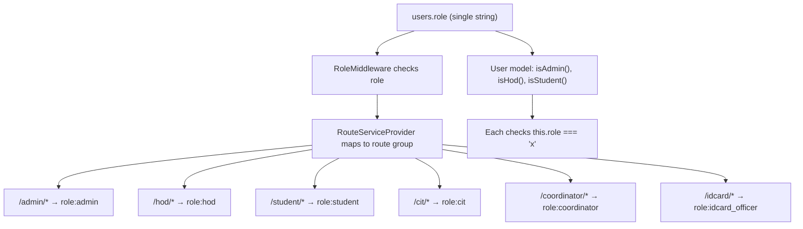
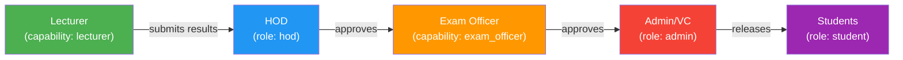

# MD Files & Roles/Permissions Analysis

## Part 1: MD Files Review — Are They Sufficient?

### Summary Table

| Document | Purpose | Sufficient? | Gaps |
|---|---|---|---|
| [SYSTEM_DOCUMENTATION.md](file:///c:/laragon/www/admission/SYSTEM_DOCUMENTATION.md) | System overview | ✅ Good | Missing: Lecturer, Exam Officer roles; no API docs |
| [RESULT_PROCESSING_EXTENSION_PLAN.md](file:///c:/laragon/www/admission/RESULT_PROCESSING_EXTENSION_PLAN.md) | Full MIS roadmap | ✅ Very thorough | Has a typo (`cumulative Credit_units` on L848); missing role migration strategy |
| [RESULT_PROCESSING_PRODUCTION_SAFE.md](file:///c:/laragon/www/admission/RESULT_PROCESSING_PRODUCTION_SAFE.md) | Safe deployment guide | ✅ Good | Missing: how to add new roles to the `users.role` enum column safely |
| [COURSE_VERSIONING_DATA_INTEGRITY.md](file:///c:/laragon/www/admission/COURSE_VERSIONING_DATA_INTEGRITY.md) | Course versioning | ✅ Solid | Complete |
| [DATABASE_BACKUP_STRATEGY.md](file:///c:/laragon/www/admission/DATABASE_BACKUP_STRATEGY.md) | Backup/recovery | ✅ Good | Complete |
| [DATABASE_OPTIMIZATION_PRODUCTION_SAFE.md](file:///c:/laragon/www/admission/DATABASE_OPTIMIZATION_PRODUCTION_SAFE.md) | DB optimization | ✅ Good | Complete |
| [PRODUCTION_PACKAGE_DEPLOYMENT.md](file:///c:/laragon/www/admission/PRODUCTION_PACKAGE_DEPLOYMENT.md) | Package deployment | ✅ Good | Complete |
| [ISSUE_TEMPLATE.md](file:///c:/laragon/www/admission/ISSUE_TEMPLATE.md) | Bug reporting | ✅ Standard | Complete |
| [README.md](file:///c:/laragon/www/admission/README.md) | Project README | ⚠️ Outdated | Still shows Creative Tim boilerplate — doesn't reflect your actual system |

### Key Gaps Across All Docs

1. **No document addresses how to add new roles (Lecturer, Exam Officer) to the production `users.role` enum column** — this is the biggest missing piece
2. **No multi-role strategy documented** — the plans assume a HOD is _only_ a HOD, but in reality a HOD can also be a Lecturer
3. **README.md is completely stale** — it's the original Creative Tim Soft UI Dashboard README, not your admission system

---

## Part 2: Current Roles & Permissions — Deep Analysis

### How Roles Work Today

Your system uses a **single-role-per-user architecture**:

```
users.role → enum('applicant', 'student', 'graduate', 'hod', 'admin')
```

> [!CAUTION]
> **Critical mismatch**: The database enum has **5 values** (`applicant, student, graduate, hod, admin`) but your [Role enum](file:///c:/laragon/www/admission/app/Enums/Role.php) has **7 values** (`hod, applicant, admin, student, cit, coordinator, idcard_officer`). The `cit`, `coordinator`, and `idcard_officer` roles are not in the DB enum, and `graduate` is in the DB but not in the PHP enum.

### Current Architecture Diagram



### The Core Problem

> [!IMPORTANT]
> **A user can only have ONE role.** If Dr. Aminu is the HOD of Computer Science (`role = 'hod'`), he **cannot** also be a Lecturer who enters results. If you change his role to `lecturer`, he loses HOD access. This is a fundamental blocker for the result processing extension.

Real-world overlapping roles in a Nigerian university:

| Person | Roles Needed |
|---|---|
| HOD | HOD + Lecturer |
| Exam Officer | Exam Officer + Lecturer |
| Dean | Dean + Lecturer (+ possibly HOD) |
| Course Advisor | Lecturer + Course Advisor |
| Admin | Admin + possibly anything |

### Other Issues Found

1. **[UserPolicy](file:///c:/laragon/www/admission/app/Policies/UserPolicy.php#L108)** references `$user->isCreator()` (line 108) — this method doesn't exist on the User model
2. **[Role enum `toString()`](file:///c:/laragon/www/admission/app/Enums/Role.php#L25)** has `default => null` in a `match` on a backed enum — this is unreachable dead code
3. **DB enum vs PHP enum drift** — `graduate` in DB but not in PHP; `cit`, `coordinator`, `idcard_officer` in PHP but not in DB

---

## Part 3: Production-Safe Multi-Role Strategy

### Recommended Approach: **Capabilities Table** (not a full role rewrite)

Instead of replacing the `role` column (which would break everything), **layer a capabilities system on top**. The existing `role` column stays as the user's **primary role** for routing/dashboard, and a new `user_capabilities` table grants additional access.

### Why This Is Safe

- ✅ **Zero changes** to existing `users` table or `role` column
- ✅ **Zero changes** to existing `RoleMiddleware`, `RouteServiceProvider`, or route files
- ✅ Existing `isAdmin()`, `isHod()`, `isStudent()` methods remain untouched
- ✅ All current user sessions, logins, and redirects work identically
- ✅ Additive only — new tables, new methods, new routes

### Database Changes (All New Tables — Zero Risk)

```php
// Migration 1: User capabilities table
Schema::create('user_capabilities', function (Blueprint $table) {
    $table->id();
    $table->foreignUuid('user_id')->constrained()->cascadeOnDelete();
    $table->string('capability'); // 'lecturer', 'exam_officer', 'course_advisor', 'dean'
    $table->foreignId('department_id')->nullable()->constrained();
    $table->boolean('is_active')->default(true);
    $table->timestamp('granted_at')->useCurrent();
    $table->timestamp('revoked_at')->nullable();
    $table->foreignUuid('granted_by')->nullable();
    $table->timestamps();
    
    $table->unique(['user_id', 'capability', 'department_id']);
});
```

> [!NOTE]
> The `lecturers` table from your extension plan is still needed for lecturer profile data (staff_id, rank, specialization). The `user_capabilities` table handles **authorization** while `lecturers` handles **profile data**.

### User Model Changes (Additive Only)

```php
// Add to existing User model — NO existing code is touched

// New relationship
public function capabilities(): HasMany
{
    return $this->hasMany(UserCapability::class)
        ->where('is_active', true);
}

// New capability checks (these do NOT replace existing role checks)
public function hasCapability(string $capability): bool
{
    return $this->capabilities()
        ->where('capability', $capability)
        ->exists();
}

public function canActAsLecturer(): bool
{
    return $this->hasCapability('lecturer');
}

public function canActAsExamOfficer(): bool
{
    return $this->hasCapability('exam_officer');
}

public function canActAsCourseAdvisor(): bool
{
    return $this->hasCapability('course_advisor');
}

// Get department IDs where user has a specific capability
public function capabilityDepartments(string $capability): array
{
    return $this->capabilities()
        ->where('capability', $capability)
        ->pluck('department_id')
        ->toArray();
}
```

### How This Solves the HOD + Lecturer Problem

**Scenario: Dr. Aminu is HOD of Computer Science AND teaches CSC201, CSC305**

| Layer | What it does |
|---|---|
| `users.role = 'hod'` | He logs in, sees HOD dashboard, accesses `/hod/*` routes |
| `user_capabilities: {capability: 'lecturer', department_id: 5}` | He can **also** access lecturer features (result entry, course view) |
| `course_allocations: {lecturer_id: user_id, ...}` | Specific courses allocated to him |

### New Middleware (Doesn't Replace Existing)

```php
// App\Http\Middleware\CapabilityMiddleware.php
class CapabilityMiddleware
{
    public function handle(Request $request, Closure $next, string $capabilities): Response
    {
        $user = $request->user();
        if (!$user) {
            return redirect()->route('login');
        }

        // Admin always passes
        if ($user->isAdmin()) {
            return $next($request);
        }

        $required = collect(explode(',', $capabilities))
            ->map(fn($c) => trim($c))->filter()->all();

        foreach ($required as $capability) {
            if ($user->hasCapability($capability)) {
                return $next($request);
            }
        }

        abort(403, 'Insufficient capabilities');
    }
}
```

### New Routes (Separate from Existing)

```php
// In RouteServiceProvider — add a NEW method, don't modify existing ones

protected function mapLecturerRoutes()
{
    Route::middleware(['web', 'auth', 'verified', 'capability:lecturer'])
        ->prefix('lecturer')
        ->as('lecturer.')
        ->group(base_path('routes/lecturer.php'));
}

protected function mapExamOfficerRoutes()
{
    Route::middleware(['web', 'auth', 'verified', 'capability:exam_officer'])
        ->prefix('exam-officer')
        ->as('exam-officer.')
        ->group(base_path('routes/exam_officer.php'));
}
```

### How Approval Workflow Works



The HOD can:
- Go to `/hod/*` (via existing `role:hod` middleware) → approve results, view department applicants
- Go to `/lecturer/*` (via new `capability:lecturer` middleware) → enter results for allocated courses

### ResultPolicy Updated to Use Capabilities

```php
class ResultPolicy
{
    public function create(User $user): bool
    {
        return $user->canActAsLecturer() || $user->isAdmin();
    }

    public function update(User $user, Result $result): bool
    {
        if ($user->canActAsLecturer()) {
            return $result->status === 'pending' && 
                   $result->lecturer_id === $user->id;
        }
        return $user->isAdmin();
    }

    public function approve(User $user, Result $result): bool
    {
        // HOD approves at department level (uses existing role)
        if ($user->isHod() && $result->status === 'submitted') {
            $hodDept = $user->hodDetails?->department_id;
            return $result->departmentCourse->department_id === $hodDept;
        }

        // Exam officer approves at faculty level (uses capability)
        if ($user->canActAsExamOfficer() && $result->status === 'hod_approved') {
            return true;
        }

        return false;
    }
}
```

---

## Part 4: Implementation Steps (Production-Safe Order)

### Phase 0 — Fix Existing Issues (Safe, No Downtime)
- [ ] Sync the DB `role` enum with the PHP enum (add `cit`, `coordinator`, `idcard_officer`; optionally keep `graduate`)
- [ ] Remove dead `isCreator()` reference in `UserPolicy`
- [ ] Clean up `default => null` in Role enum `toString()`

### Phase 1 — Add Capabilities System (Safe, No Downtime)
- [ ] Create `user_capabilities` migration (new table)
- [ ] Create `UserCapability` model
- [ ] Add capability methods to `User` model (additive only)
- [ ] Create `CapabilityMiddleware`
- [ ] Register middleware in bootstrap/app or kernel

### Phase 2 — Add Lecturer/Exam Officer Features (Safe, No Downtime)
- [ ] Create `lecturers` table (new)
- [ ] Create `course_allocations` table (new)
- [ ] Create `routes/lecturer.php` (new file)
- [ ] Add `mapLecturerRoutes()` to `RouteServiceProvider`
- [ ] Build Lecturer dashboard & result entry components

### Phase 3 — Assign Capabilities to Existing Users
- [ ] Admin UI to grant/revoke capabilities
- [ ] Seed HOD users with `lecturer` capability if they teach
- [ ] Assign `exam_officer` capability to designated staff

> [!TIP]
> **Key principle**: The `users.role` column determines **which dashboard/route group** a user sees by default. Capabilities determine **what additional features** they can access. This separation means zero breaking changes.

---

## Part 5: Dashboard Navigation for Multi-Role Users

Since a HOD with lecturer capability needs to access both dashboards, add a **role switcher** in the navigation:

```blade
{{-- In HOD layout sidebar --}}
@if(auth()->user()->canActAsLecturer())
    <a href="{{ route('lecturer.dashboard') }}" class="...">
        <i class="fas fa-chalkboard-teacher"></i>
        <span>Lecturer Panel</span>
    </a>
@endif

{{-- In Lecturer layout sidebar --}}
@if(auth()->user()->isHod())
    <a href="{{ route('hod.dashboard') }}" class="...">
        <i class="fas fa-user-tie"></i>
        <span>HOD Panel</span>
    </a>
@endif
```

This is similar to how your impersonation system works already, but without actually changing the role.
