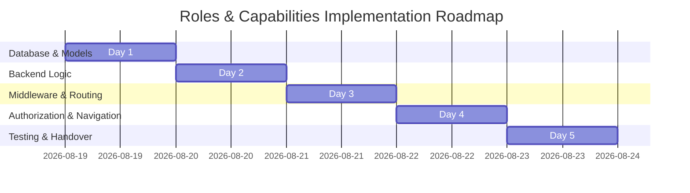

# Implementation Plan — Multi-Role Capabilities System (5-Day Plan)

This plan breaks down the Roles & Permissions capability layer into daily, self-contained milestones. Each day is designed to be easily executable by an AI coding agent with clear instructions, code stubs, and verification tests.

---

## Daily Milestones Overview



---

## Day 1: Database Setup and Enum Modifications

### Objective
Safely alter the database `users.role` enum on the live database and create the new table for capabilities.

### Tasks

#### 1.1 Create Migration to Alter Enum
Create a migration named `database/migrations/xxxx_xx_xx_xxxxxx_extend_users_role_enum.php`:
```php
<?php

use Illuminate\Database\Migrations\Migration;
use Illuminate\Support\Facades\DB;

return new class extends Migration {
    public function up(): void
    {
        // Add missing roles and new result processing roles to users.role enum
        DB::statement("ALTER TABLE users MODIFY COLUMN role 
            ENUM('applicant', 'student', 'graduate', 'hod', 'admin', 
                 'cit', 'coordinator', 'idcard_officer', 'lecturer', 'exam_officer') 
            DEFAULT 'applicant'");
    }

    public function down(): void
    {
        // Safety rollback check: only rollback if no users are assigned the new roles
        DB::statement("ALTER TABLE users MODIFY COLUMN role 
            ENUM('applicant', 'student', 'graduate', 'hod', 'admin') 
            DEFAULT 'applicant'");
    }
};
```

#### 1.2 Create Migration for `user_capabilities` Table
Create a migration named `database/migrations/xxxx_xx_xx_xxxxxx_create_user_capabilities_table.php`:
```php
<?php

use Illuminate\Database\Migrations\Migration;
use Illuminate\Database\Schema\Blueprint;
use Illuminate\Support\Facades\Schema;

return new class extends Migration {
    public function up(): void
    {
        Schema::create('user_capabilities', function (Blueprint $table) {
            $table->id();
            $table->foreignUuid('user_id')->constrained()->cascadeOnDelete();
            $table->string('capability'); // e.g., 'lecturer', 'exam_officer'
            $table->foreignId('department_id')->nullable()->constrained()->nullOnDelete();
            $table->boolean('is_active')->default(true);
            $table->timestamp('granted_at')->useCurrent();
            $table->timestamp('revoked_at')->nullable();
            $table->foreignUuid('granted_by')->nullable();
            $table->text('reason')->nullable();
            $table->timestamps();
            
            $table->unique(['user_id', 'capability', 'department_id']);
            $table->index(['user_id', 'is_active']);
            $table->index('capability');
        });
    }

    public function down(): void
    {
        Schema::dropIfExists('user_capabilities');
    }
};
```

#### 1.3 Create the UserCapability Model
Create [`app/Models/UserCapability.php`](file:///c:/laragon/www/admission/app/Models/UserCapability.php):
```php
<?php

namespace App\Models;

use Illuminate\Database\Eloquent\Model;
use Illuminate\Database\Eloquent\Relations\BelongsTo;

class UserCapability extends Model
{
    protected $fillable = [
        'user_id',
        'capability',
        'department_id',
        'is_active',
        'granted_at',
        'revoked_at',
        'granted_by',
        'reason',
    ];

    protected $casts = [
        'is_active' => 'boolean',
        'granted_at' => 'datetime',
        'revoked_at' => 'datetime',
    ];

    public function user(): BelongsTo
    {
        return $this->belongsTo(User::class);
    }

    public function department(): BelongsTo
    {
        return $this->belongsTo(Department::class);
    }
}
```

### Day 1 Verification Checklist
- [ ] Run `php artisan migrate` without errors.
- [ ] Inspect MySQL schema: verify `users.role` includes `'lecturer'` and `'exam_officer'`.
- [ ] Inspect MySQL schema: verify `user_capabilities` table exists with foreign key constraints.

---

## Day 2: PHP Enum Update & User Model Helpers

### Objective
Synchronize the PHP model layer, register the new role cases, and expose capabilities relationships.

### Tasks

#### 2.1 Update [`app/Enums/Role.php`](file:///c:/laragon/www/admission/app/Enums/Role.php)
Replace the contents to define all 9 backed enum roles and clean up the `default` fallback:
```php
<?php

namespace App\Enums;

enum Role: string
{
    case HOD = 'hod';
    case APPLICANT = 'applicant';
    case ADMIN = 'admin';
    case STUDENT = 'student';
    case CIT = 'cit';
    case COORDINATOR = 'coordinator';
    case IDCARD_OFFICER = 'idcard_officer';
    case LECTURER = 'lecturer';
    case EXAM_OFFICER = 'exam_officer';

    public function toString(): string
    {
        return match ($this) {
            self::HOD => 'Head of Department',
            self::APPLICANT => 'Applicant',
            self::ADMIN => 'Admin',
            self::STUDENT => 'Student',
            self::CIT => 'CIT',
            self::COORDINATOR => 'Coordinator',
            self::IDCARD_OFFICER => 'ID Card Officer',
            self::LECTURER => 'Lecturer',
            self::EXAM_OFFICER => 'Exam Officer',
        };
    }

    public static function getRoles(): array
    {
        return array_map(function (Role $role) {
            return [
                'name' => $role->toString(),
                'value' => $role->value,
            ];
        }, self::cases());
    }
}
```

#### 2.2 Add Helper Methods to [`app/Models/User.php`](file:///c:/laragon/www/admission/app/Models/User.php)
Add the relationship and helper check methods to the `User` class (without deleting existing methods):
```php
// Relationship to capabilities
public function capabilities(): \Illuminate\Database\Eloquent\Relations\HasMany
{
    return $this->hasMany(UserCapability::class)->where('is_active', true);
}

// Capability check logic
public function hasCapability(string $capability): bool
{
    return $this->capabilities()->where('capability', $capability)->exists();
}

public function canActAsLecturer(): bool
{
    return $this->role === Role::LECTURER->value || $this->hasCapability('lecturer');
}

public function canActAsExamOfficer(): bool
{
    return $this->role === Role::EXAM_OFFICER->value || $this->hasCapability('exam_officer');
}

// Support for pure roles
public function isLecturer(): bool
{
    if ($this->impersonateRole) {
        return $this->impersonateRole === Role::LECTURER->value;
    }
    return $this->role === Role::LECTURER->value;
}

public function isExamOfficer(): bool
{
    if ($this->impersonateRole) {
        return $this->impersonateRole === Role::EXAM_OFFICER->value;
    }
    return $this->role === Role::EXAM_OFFICER->value;
}
```

### Day 2 Verification Checklist
- [ ] Create a test route that prints `Role::getRoles()`: verify all 9 roles show up.
- [ ] Run `php artisan tinker`: instantiate a User, verify `$user->capabilities` relationship is chainable.

---

## Day 3: CapabilityMiddleware & Route Mapping

### Objective
Create routing boundaries that check for capabilities (or roles) and hook up the new dashboards.

### Tasks

#### 3.1 Create CapabilityMiddleware
Create [`app/Http/Middleware/CapabilityMiddleware.php`](file:///c:/laragon/www/admission/app/Http/Middleware/CapabilityMiddleware.php):
```php
<?php

namespace App\Http\Middleware;

use Closure;
use Illuminate\Http\Request;
use Symfony\Component\HttpFoundation\Response;

class CapabilityMiddleware
{
    public function handle(Request $request, Closure $next, string $capabilities): Response
    {
        $user = $request->user();

        if (!$user) {
            return redirect()->route('login');
        }

        // Admin bypasses all checks
        if ($user->isAdmin()) {
            return $next($request);
        }

        $required = collect(explode(',', $capabilities))
            ->map(fn($c) => trim($c))
            ->filter()
            ->all();

        foreach ($required as $capability) {
            if ($user->role === $capability || $user->hasCapability($capability)) {
                return $next($request);
            }
        }

        // Fallback redirects
        $redirectRoute = match ($user->role) {
            'hod' => 'hod.dashboard',
            'admin' => 'admin.dashboard',
            'student' => 'student.dashboard',
            'cit' => 'cit.dashboard',
            'coordinator' => 'coordinator.dashboard',
            'idcard_officer' => 'idcard.processing',
            'lecturer' => 'lecturer.dashboard',
            'exam_officer' => 'exam-officer.dashboard',
            default => 'analytics',
        };

        return redirect()->route($redirectRoute);
    }
}
```

#### 3.2 Register Middleware
In `app/Http/Kernel.php` (Laravel 10-) or `bootstrap/app.php` (Laravel 11+), register the middleware alias:
```php
'capability' => \App\Http\Middleware\CapabilityMiddleware::class,
```

#### 3.3 Register Lecturer/Exam Officer Dashboards & Redirects
* Update `RoleMiddleware` match block to include `lecturer` and `exam_officer`.
* Update `RedirectIfAuthenticated` to map `lecturer` to `/lecturer/dashboard` and `exam_officer` to `/exam-officer/dashboard`.
* Define mapping routines in [`app/Providers/RouteServiceProvider.php`](file:///c:/laragon/www/admission/app/Providers/RouteServiceProvider.php) and write route stubs:
  * Create empty `routes/lecturer.php` with a simple placeholder dashboard route.
  * Create empty `routes/exam_officer.php` with a placeholder dashboard route.

### Day 3 Verification Checklist
- [ ] Confirm `php artisan route:list` registers routes prefixed with `/lecturer/` and `/exam-officer/`.
- [ ] Attempt accessing `/lecturer/dashboard` with a student account: verify you are redirected to `/student/dashboard`.

---

## Day 4: Policy Updates and Navigation UI

### Objective
Wire the authorization policy layer and add the multi-role layout switchers.

### Tasks

#### 4.1 Update Policy Authorizations
Update your application policies (like `ResultPolicy` or similar models) to verify dynamic permissions:
```php
public function create(User $user): bool
{
    return $user->canActAsLecturer(); // True if role is lecturer OR has capability
}

public function approve(User $user, Result $result): bool
{
    if ($user->isHod()) {
        return $result->status === 'submitted' &&
               $user->hodDetails->department_id === $result->department_id;
    }
    
    if ($user->canActAsExamOfficer()) {
        return $result->status === 'hod_approved';
    }
    
    return false;
}
```

#### 4.2 Sidebar Switcher UI
Add the sidebar templates so Dr. Aminu can switch panel contexts easily without signing out.
```blade
{{-- HOD sidebar template --}}
@if(auth()->user()->canActAsLecturer())
    <li class="nav-item">
        <a href="{{ route('lecturer.dashboard') }}">
            <i class="fas fa-chalkboard-teacher text-info"></i>
            <span>Switch to Lecturer Dashboard</span>
        </a>
    </li>
@endif
```

### Day 4 Verification Checklist
- [ ] Verify switcher link is only visible to HOD accounts that have `lecturer` capability records.
- [ ] Verify that clicking the link navigates to the Lecturer dashboard.

---

## Day 5: Verification & Seeding

### Objective
Perform testing and verify no regressions in the live database schema.

### Tasks

#### 5.1 Create Seeder helper
Create `database/seeders/UserCapabilitiesSeeder.php` to assign temporary capabilities to HODs:
```php
<?php

namespace Database\Seeders;

use App\Models\User;
use App\Models\UserCapability;
use Illuminate\Database\Seeder;

class UserCapabilitiesSeeder extends Seeder
{
    public function run(): void
    {
        $hod = User::where('role', 'hod')->first();
        
        if ($hod) {
            UserCapability::firstOrCreate([
                'user_id' => $hod->id,
                'capability' => 'lecturer',
                'department_id' => $hod->hodDetails?->department_id ?? null,
                'is_active' => true,
                'reason' => 'Initial seeder test capability'
            ]);
        }
    }
}
```

#### 5.2 Verification Tasks
- [ ] Run `php artisan db:seed --class=UserCapabilitiesSeeder`.
- [ ] Log in as HOD, switch to Lecturer view, enter a test result, and return back.
- [ ] Verify that pure lecturers can only view `/lecturer/*` and never HOD or Admin portals.

---

## Proposed Verification Plan

### Automated Tests
```bash
# Run existing test suite to check for regressions
php artisan test
```

### Manual Verification
1. Log in with a HOD account. Verify HOD dashboard features display normally.
2. Link the HOD account with the `'lecturer'` capability in `user_capabilities`.
3. Reload dashboard: verify the "Switch to Lecturer Dashboard" link displays.
4. Click the link and verify you can read `/lecturer/*` routes.
5. Create a pure Lecturer account. Verify they redirect straight to `/lecturer/dashboard` upon login and cannot access `/hod/*` or `/admin/*`.
