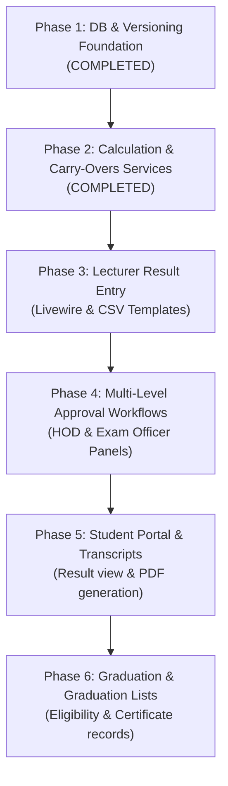

# Playbook: Implementing Result Processing via AI Coding Agent

This document outlines how to safely and systematically instruct an AI coding agent to implement the entire **Result Processing & Student MIS Extension** in production-safe phases.

---

## ⚠️ The 3 Golden Rules for Agent-Led Development

AI agents are powerful, but they can suffer from **context drift** or **accidentally break existing code** if asked to do too much at once. When prompting your agent, enforce these constraints:

1. **Strict Feature Gating (Feature Flags):** All new tables, routes, and controllers must be inactive for normal users until explicitly enabled via `config/features.php` or `.env`.
2. **Test-Driven Development (TDD):** Instruct the agent to write a Feature/Unit test *before* or *alongside* any new service (e.g., test GPA calculation with mock data before linking to a controller).
3. **No Large Single Tasks:** Do not tell the agent: *"Implement result processing."* Tell it: *"Implement Phase 1, Step 1: Create the migrations and models for the new database tables."*

---

## Overall Phased Roadmap

To implement the entire system safely on production, execute the phases in this order:



---

## Phase 1: Database & Versioning Foundation (✅ COMPLETED)
* **Goal:** Create all database tables, models, and relationships needed for result tracking and course versioning.
* **Risk Profile:** Zero (all additions are brand new tables).
* **Status:** **Completed & Verified** (August 2026)

### Completed Tasks Checklist
- [x] Created `course_versions` migration & model (`CourseVersion.php`)
- [x] Created `course_change_history` migration & model (`CourseChangeHistory.php`)
- [x] Created `course_mappings` migration & model (`CourseMapping.php`)
- [x] Created `user_capabilities` migration & model (`UserCapability.php`)
- [x] Created `results` migration & model (`Result.php`)
- [x] Created `result_gpa_records` migration & model (`ResultGpaRecord.php`)
- [x] Created `result_approvals` migration & model (`ResultApproval.php`)
- [x] Created `carry_over_courses` migration & model (`CarryOverCourse.php`)
- [x] Added course snapshot columns to `registered_courses` table & model
- [x] Established Eloquent relationships across `User`, `Department`, `Course`, `RegisteredCourse`, `DepartmentCourse`
- [x] Migrated cleanly via `php artisan migrate`
- [x] Created & passed automated test suite: `tests/Unit/Phase1DatabaseFoundationTest.php` (5 tests, 19 assertions)

---

## Phase 2: Core Calculations & Carry-Overs Services (✅ COMPLETED)
* **Goal:** Implement the logic that calculates GPA, updates CGPA, automatically registers carry-over courses, manages academic standing, and decoupled level progression (Postgraduate strictly untouched).
* **Risk Profile:** Low (logical service layer).
* **Status:** **Completed & Verified** (August 2026)

### Completed Tasks Checklist
- [x] Implemented `App\Services\GradeCalculationService`:
  - NUC 5-point grading scale (A: 70-100, B: 60-69, C: 50-59, D: 45-49, F: 0-44).
  - Quality point math ($GP \times Units$).
  - Semester GPA calculation & Cumulative GPA (CGPA) aggregation.
  - Official NUC Class of Degree classification.
  - Automatic persistence to `ResultGpaRecord`.
- [x] Implemented `App\Services\AcademicProgressionService`:
  - Academic standing rules: `PROMOTED` ($CGPA \ge 1.50$), `PROBATION` ($1.00 \le CGPA < 1.50$), `REPEAT` ($CGPA < 1.00$), and `SPILLOVER`.
  - Cap final-year students with uncleared carry-overs at maximum program duration (prevents invalid levels like 500L for 4-year programs).
  - Direct Entry (DE) handling: starting at 200L.
  - Protected postgraduate workflows from undergraduate progression mutations.
- [x] Implemented `App\Services\CarryOverRegistrationService`:
  - Automatic carry-over course recording upon failed results.
  - Active carry-over retrieval filtered by semester.
  - Automatic clearance upon approved retake passing score ($\ge 45$).
  - Credit unit load validation (minimum 15, maximum 24 units).
- [x] Integrated `AcademicProgressionService` with `PaymentService::getUgStudentLevel()`.
- [x] Created & passed automated test suites:
  - `tests/Unit/GradeCalculationTest.php` (5 tests, 26 assertions)
  - `tests/Unit/AcademicProgressionTest.php` (4 tests, 7 assertions)
  - `tests/Unit/CarryOverRegistrationTest.php` (3 tests, 16 assertions)

---

## Phase 3: Lecturer Result Entry (Web Form & CSV Upload)
* **Goal:** Let teachers manage allocated courses, enter results individually via a Livewire table, or download a CSV template and upload results in bulk.
* **Risk Profile:** Low (behind new routes under `routes/lecturer.php`).

### Agent Instructions Prompt
> **Prompt for Agent:**
> "Please implement Phase 3: Lecturer Result Entry Module.
> 
> Tasks:
> 1. Create routes file `routes/lecturer.php` and map it in `RouteServiceProvider` protected by `capability:lecturer` middleware.
> 2. Create the `LecturerDashboard` and `ResultEntry` Livewire components.
> 3. Implement the Individual Web Entry Form (Livewire grid with inline validation: CA: 0-40, Exam: 0-60).
> 4. Implement CSV Bulk Upload:
>    - Download template containing enrolled students' matric numbers.
>    - Import CSV, validate data integrity, and show error reports if records are missing or scores exceed limits.
>    - Allow lecturers to review changes before clicking 'Submit'."

---

## Phase 4: Multi-Level Approval Workflows
* **Goal:** Implement the step-by-step submission and approval workflow (Lecturer -> HOD -> Exam Officer -> VC).
* **Risk Profile:** Low (affects status values on `results` and `result_approvals` tables).

### Agent Instructions Prompt
> **Prompt for Agent:**
> "Please implement Phase 4: Result Approvals Workflow.
> 
> Tasks:
> 1. Set up the state machine transition rules for Results (`pending` -> `submitted` -> `hod_approved` -> `exam_officer_approved` -> `released`).
> 2. Create the HOD Result Review Livewire component (`HodResultReview` and approval action buttons).
> 3. Create the Exam Officer Dashboard and approval actions.
> 4. Add capability switcher toggles to the navigation sidebar using layout checks (e.g. `auth()->user()->canActAsLecturer()`).
> 5. Create Feature tests simulating the full submission-to-approval flow, verifying that unauthorized users are rejected by policies."

---

## Phase 5: Student Portal & Transcript Generator
* **Goal:** Allow students to view their released results and generate unofficial transcripts. Generate official PDFs via Snappy/DomPDF.
* **Risk Profile:** Low-Medium (wires to student-facing dashboards).

### Agent Instructions Prompt
> **Prompt for Agent:**
> "Please implement Phase 5: Student Results & Transcripts.
> 
> Tasks:
> 1. Create the `MyResults` student Livewire component displaying released grades organized by Session and Semester.
> 2. Implement the `TranscriptService` (detailed in RESULT_PROCESSING_EXTENSION_PLAN.md L1020) to generate a PDF formatted according to NUC standards (showing all repeated course attempts, grades, semester GPAs, and cumulative details).
> 3. Integrate QR code markers on generated transcripts linking back to database verification."

---

## Phase 6: Graduation Processing
* **Goal:** Automatically check student graduation eligibility, generate the graduation lists, and track certificate issuances.
* **Risk Profile:** Low (primarily report/utility views).

### Agent Instructions Prompt
> **Prompt for Agent:**
> "Please implement Phase 6: Graduation Eligibility & Processing.
> 
> Tasks:
> 1. Implement `App\Services\GraduationService` (detailed in RESULT_PROCESSING_EXTENSION_PLAN.md L1102):
>    - Check minimum CGPA threshold (>= 1.00 or 1.50).
>    - Confirm completion of General Studies, SIWES, and Entrepreneurship credits.
>    - Ensure no outstanding failed courses remain in `carry_over_courses`.
> 2. Create the Admin panel Livewire views to publish graduation ceremonies and view/print the Graduation List.
> 3. Create the Certificate tracking module."

---

## How to Manage Cache and Migrations on Production

Instruct your agent to use this script template whenever executing updates:

```bash
# Put app in maintenance mode during updates
php artisan down

# Execute migrations safely
php artisan migrate --force

# Reset cache configs
php artisan cache:clear
php artisan config:clear
php artisan view:clear
php artisan route:clear

# Warm cache config back up
php artisan config:cache
php artisan route:cache

# Return online
php artisan up
```
