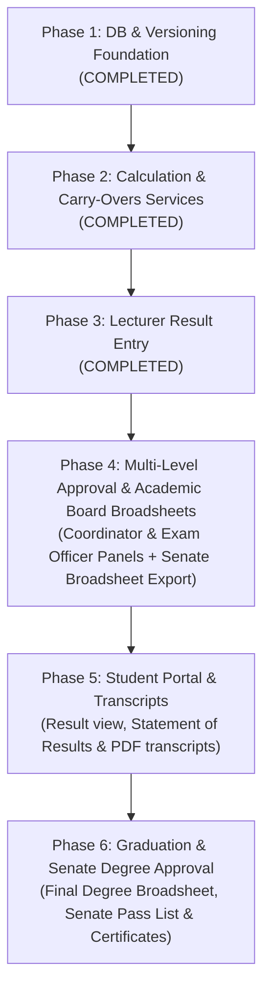

# Playbook: Implementing Result Processing via AI Coding Agent

This document outlines how to safely and systematically instruct an AI coding agent to implement the entire **Result Processing & Student MIS Extension** in production-safe phases.

---

## ⚠️ The 3 Golden Rules for Agent-Led Development

AI agents are powerful, but they can suffer from **context drift** or **accidentally break existing code** if asked to do too much at once. When prompting your agent, enforce these constraints:

1. **Strict Feature Gating (Feature Flags):** All new tables, routes, and controllers must be inactive for normal users until explicitly enabled via `config/features.php` or `.env`.
2. **Test-Driven Development (TDD):** Instruct the agent to write a Feature/Unit test *before* or *alongside* any new service (e.g., test GPA calculation with mock data before linking to a controller).
3. **No Large Single Tasks:** Do not tell the agent: *"Implement result processing."* Tell it: *"Implement Phase 1, Step 1: Create the migrations and models for the new database tables."*

---

## Overall Phased Roadmap

To implement the entire system safely on production, execute the phases in this order:



---

## Phase 1: Database & Versioning Foundation (✅ COMPLETED)
* **Goal:** Create all database tables, models, and relationships needed for result tracking and course versioning.
* **Risk Profile:** Zero (all additions are brand new tables).
* **Status:** **Completed & Verified** (August 2026)

### Completed Tasks Checklist
- [x] Created `course_versions` migration & model (`CourseVersion.php`)
- [x] Created `course_change_history` migration & model (`CourseChangeHistory.php`)
- [x] Created `course_mappings` migration & model (`CourseMapping.php`)
- [x] Created `user_capabilities` migration & model (`UserCapability.php`)
- [x] Created `results` migration & model (`Result.php`)
- [x] Created `result_gpa_records` migration & model (`ResultGpaRecord.php`)
- [x] Created `result_approvals` migration & model (`ResultApproval.php`)
- [x] Created `carry_over_courses` migration & model (`CarryOverCourse.php`)
- [x] Added course snapshot columns to `registered_courses` table & model
- [x] Established Eloquent relationships across `User`, `Department`, `Course`, `RegisteredCourse`, `DepartmentCourse`
- [x] Migrated cleanly via `php artisan migrate`
- [x] Created & passed automated test suite: `tests/Unit/Phase1DatabaseFoundationTest.php` (5 tests, 19 assertions)

---

## Phase 2: Core Calculations & Carry-Overs Services (✅ COMPLETED)
* **Goal:** Implement the logic that calculates GPA, updates CGPA, automatically registers carry-over courses, manages academic standing, and decoupled level progression (Postgraduate strictly untouched).
* **Risk Profile:** Low (logical service layer).
* **Status:** **Completed & Verified** (August 2026)

### Completed Tasks Checklist
- [x] Implemented `App\Services\GradeCalculationService`:
  - NUC 5-point grading scale (A: 70-100, B: 60-69, C: 50-59, D: 45-49, F: 0-44).
  - Quality point math ($GP \times Units$).
  - Semester GPA calculation & Cumulative GPA (CGPA) aggregation.
  - Official NUC Class of Degree classification.
  - Automatic persistence to `ResultGpaRecord`.
- [x] Implemented `App\Services\AcademicProgressionService`:
  - Academic standing rules: `PROMOTED` ($CGPA \ge 1.50$), `PROBATION` ($1.00 \le CGPA < 1.50$), `REPEAT` ($CGPA < 1.00$), and `SPILLOVER`.
  - Cap final-year students with uncleared carry-overs at maximum program duration (prevents invalid levels like 500L for 4-year programs).
  - Direct Entry (DE) handling: starting at 200L.
  - Protected postgraduate workflows from undergraduate progression mutations.
- [x] Implemented `App\Services\CarryOverRegistrationService`:
  - Automatic carry-over course recording upon failed results.
  - Active carry-over retrieval filtered by semester.
  - Automatic clearance upon approved retake passing score ($\ge 45$).
  - Credit unit load validation (minimum 15, maximum 24 units).
- [x] Integrated `AcademicProgressionService` with `PaymentService::getUgStudentLevel()`.
- [x] Created & passed automated test suites:
  - `tests/Unit/GradeCalculationTest.php` (5 tests, 26 assertions)
  - `tests/Unit/AcademicProgressionTest.php` (4 tests, 7 assertions)
  - `tests/Unit/CarryOverRegistrationTest.php` (3 tests, 16 assertions)

---

## Phase 3: Lecturer Result Entry (Web Form & CSV Upload) (✅ COMPLETED)
* **Goal:** Let teachers manage allocated courses, enter results individually via a Livewire table, or download a CSV template and upload results in bulk.
* **Risk Profile:** Low (behind new routes under `routes/lecturer.php`).
* **Status:** **Completed & Verified** (August 2026)

### Completed Tasks Checklist
- [x] Created `routes/lecturer.php` mapped via `RouteServiceProvider` with `capability:lecturer` middleware.
- [x] Created `CourseAllocation` model and relationship mapping.
- [x] Implemented `LecturerDashboard` component (`LecturerDashboard.php` & `lecturer-dashboard.blade.php`).
- [x] Implemented `ResultEntry` component (`ResultEntry.php` & `result-entry.blade.php`) with inline CA (0-40) and Exam (0-60) validation.
- [x] Integrated `AcademicSessionService` with session & semester override dropdowns.
- [x] Implemented CSV template download (`ResultTemplateExport.php`) and bulk CSV upload (`ResultImport.php`).
- [x] Implemented submission workflow (`submitAll`) to transition pending results to `submitted` status for each student's assigned coordinator.
- [x] Created test suite: `tests/Feature/LecturerResultEntryTest.php`.

---

## Phase 4: Course Allocations, Multi-Level Approval & Senate Broadsheets (✅ CORE COMPLETED)
* **Goal:** Course Allocation, multi-level approval workflow (Lecturer -> Coordinator -> Exam Officer -> Released), and generating official Departmental / Senate Broadsheets for Academic Board approval.
* **Risk Profile:** Low.
* **Status:** **Core Completed & Verified** (August 2026)

### Completed Tasks Checklist
- [x] Created `course_allocations` table migration & model (`CourseAllocation.php`).
- [x] Created `CourseAllocationManager` Livewire component (`Admin/CourseAllocationManager.php` and view) for Admin/CIT to allocate department courses to lecturers.
- [x] Added Course Allocation links in `admin-sidebar.blade.php` and `cit-sidebar.blade.php`.
- [x] Implemented Coordinator Result Review component (`CoordinatorResultReview.php` & `coordinator-result-review.blade.php`) with multi-level course inspection, SQL summaries, paginated review, batch approval (`status = 'exam_officer_approved'`), and return/rejection audit actions.
- [x] Implemented Exam Officer Result Review component (`ExamOfficerResultReview.php` & `exam-officer-result-review.blade.php`) with institutional grade auditing, batch result release (`status = 'released'`), GPA calculation triggering (`ResultGpaRecord`), and carry-over processing.
- [x] Registered routes in `routes/coordinator.php` (`coordinator.result-review`) and `routes/exam_officer.php` (`exam-officer.results-review`).
- [x] Added navigation menu links in `coordinator-sidebar.blade.php` and `exam-officer-sidebar.blade.php`.
- [x] Created and passed `tests/Feature/ResultApprovalWorkflowTest.php` (4 tests) for coordinator approval, return, Exam Officer release, and Exam Officer return.

### Admission Cohort Population (✅ COMPLETED)
- [x] Populate `academic_details.admission_session` when each student's academic detail is created during admission or import (`AcademicDetailForm.php` & `UgAcademicDetailForm.php`).
- [x] Provide an admin-reviewed backfill queue that derives historical admission sessions from the first two matric-number digits, for example `24...` to `2024/2025` and `25...` to `2025/2026` (`AdmissionSessionSynchronizer.php`).
- [x] Added feature coverage proving coordinator resolution remains cohort-specific across multiple admission sessions (`AdmissionSessionPopulationTest.php`).

### Academic Board & Senate Broadsheet Reporting Deliverables (Phase 4 Extension)
> **Academic Board Review Context:** Before official release to students, results are reviewed by the Departmental Board of Examiners, Faculty Board, and Academic Board / Senate.
- **Departmental Semester Broadsheet (Master Sheet)**: Matrix PDF/Excel showing students vs all registered courses, CA/Exam scores, Total, Grade, Semester GPA, and Academic Standing (Promoted, Probation, Spillover, Repeat).
- **Course-Level Official Score Sheet**: Printable signed sheet with Lecturer, Coordinator, and Exam Officer endorsements.
- **Senate Summary Report**: Institutional summary of pass/fail statistics and GPA distributions presented for Academic Board approval before final release.

---

## Phase 5: Student Portal & Transcript Generator
* **Goal:** Allow students to view their released results, print Semester Statements of Results, and generate official NUC-compliant transcripts with QR verification.
* **Risk Profile:** Low-Medium (wires to student-facing dashboards).

### Agent Instructions Prompt
> **Prompt for Agent:**
> "Please implement Phase 5: Student Results & Transcripts.
> 
> Tasks:
> 1. Create the `MyResults` student Livewire component displaying released grades organized by Session and Semester.
> 2. Implement Semester Statement of Result printable slip for students.
> 3. Implement the `TranscriptService` (detailed in RESULT_PROCESSING_EXTENSION_PLAN.md L1020) to generate an official PDF transcript formatted according to NUC standards (showing all repeated course attempts, grades, semester GPAs, and cumulative details).
> 4. Integrate QR code markers on generated transcripts linking back to database verification."

---

## Phase 6: Graduation Processing & Senate Final Degree Approval
* **Goal:** Automatically check student graduation eligibility, generate the Senate Graduation Broadsheet, and track certificate issuances.
* **Risk Profile:** Low (primarily report/utility views).

### Academic Board / Senate Deliverables in Phase 6:
- **Senate Graduation Broadsheet**: Master list of graduands by department with total credits earned, final CGPA, and recommended Class of Degree (First Class, Second Class Upper, etc.) presented for Senate degree conferment.
- **Official Graduating List / Pass List**: Approved publication list for convocation, degree certificates, and NYSC mobilization.

### Agent Instructions Prompt
> **Prompt for Agent:**
> "Please implement Phase 6: Graduation Eligibility & Processing.
> 
> Tasks:
> 1. Implement `App\Services\GraduationService` (detailed in RESULT_PROCESSING_EXTENSION_PLAN.md L1102):
>    - Check minimum CGPA threshold (>= 1.00 or 1.50).
>    - Confirm completion of General Studies, SIWES, and Entrepreneurship credits.
>    - Ensure no outstanding failed courses remain in `carry_over_courses`.
> 2. Create the Admin / Exam Officer panel to generate and export the **Senate Graduation Broadsheet** and **Official Graduating List**.
> 3. Create the Certificate tracking module."

---

## How to Manage Cache and Migrations on Production

Instruct your agent to use this script template whenever executing updates:

```bash
# Put app in maintenance mode during updates
php artisan down

# Execute migrations safely
php artisan migrate --force

# Reset cache configs
php artisan cache:clear
php artisan config:clear
php artisan view:clear
php artisan route:clear

# Warm cache config back up
php artisan config:cache
php artisan route:cache

# Return online
php artisan up
```
