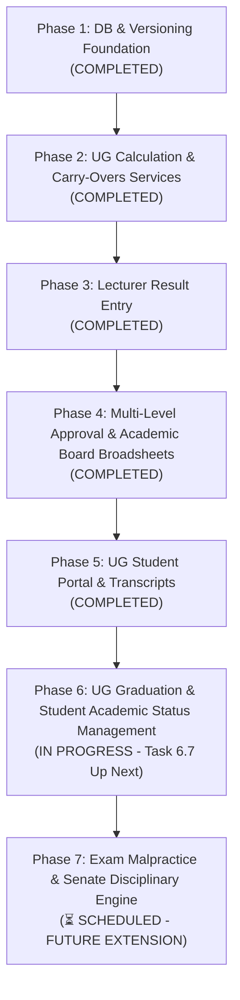

# Playbook: Implementing Undergraduate Result Processing via AI Coding Agent

This document outlines how to safely and systematically instruct an AI coding agent to implement the entire **Undergraduate Result Processing & Student MIS Extension** in production-safe phases.

> 📌 **SCOPE NOTICE: STRICTLY UNDERGRADUATE (UG)**  
> This result processing playbook, grading framework (NUC 5-point scale), academic standing rules, broadsheets, transcripts, and graduation workflows are **strictly for Undergraduate (UG) students**. Postgraduate (PG) workflows, grading scales, pass marks, and degree classifications are decoupled and must remain completely untouched.

---

## ⚠️ The 4 Golden Rules for Agent-Led Development

AI agents are powerful, but they can suffer from **context drift** or **accidentally break existing code** if asked to do too much at once. When prompting your agent, enforce these constraints:

1. **Strict Scope Boundaries (Undergraduate Only):** All calculation logic, progression rules, broadsheets, statements of results, transcripts, and graduation eligibility checks apply **strictly to Undergraduate students**. Ensure Postgraduate data remains completely isolated and unaffected.
2. **Strict Feature Gating (Feature Flags):** All new tables, routes, and controllers must be inactive for normal users until explicitly enabled via `config/features.php` or `.env`.
3. **Test-Driven Development (TDD):** Instruct the agent to write a Feature/Unit test *before* or *alongside* any new service (e.g., test GPA calculation with mock data before linking to a controller).
4. **No Large Single Tasks:** Do not tell the agent: *"Implement result processing."* Tell it: *"Implement Phase 1, Step 1: Create the migrations and models for the new database tables."*

---

## Overall Phased Roadmap (Undergraduate)

To implement the entire system safely on production, execute the phases in this order:


```mermaid
graph TD
    P1["Phase 1: DB & Versioning Foundation<br/>(COMPLETED)"] --> P2["Phase 2: UG Calculation & Carry-Overs Services<br/>(COMPLETED)"]
    P2 --> P3["Phase 3: Lecturer Result Entry<br/>(COMPLETED)"]
    P3 --> P4["Phase 4: Multi-Level Approval & Academic Board Broadsheets<br/>(COMPLETED)"]
    P4 --> P5["Phase 5: UG Student Portal & Transcripts<br/>(COMPLETED)"]
    P5 --> P6["Phase 6: UG Graduation & Student Academic Status Management<br/>(IN PROGRESS - Task 6.7 Up Next)"]
    P6 --> P7["Phase 7: Exam Malpractice & Senate Disciplinary Engine<br/>(⏳ SCHEDULED - FUTURE EXTENSION)"]
```

---

## Phase 1: Database & Versioning Foundation (✅ COMPLETED)
* **Goal:** Create all database tables, models, and relationships needed for result tracking and course versioning.
* **Risk Profile:** Zero (all additions are brand new tables).
* **Status:** **Completed & Verified** (August 2026)

### Completed Tasks Checklist
- [x] Created `course_versions` migration & model (`CourseVersion.php`)
- [x] Created `course_change_history` migration & model (`CourseChangeHistory.php`)
- [x] Created `course_mappings` migration & model (`CourseMapping.php`)
- [x] Created `user_capabilities` migration & model (`UserCapability.php`)
- [x] Created `results` migration & model (`Result.php`)
- [x] Created `result_gpa_records` migration & model (`ResultGpaRecord.php`)
- [x] Created `result_approvals` migration & model (`ResultApproval.php`)
- [x] Created `carry_over_courses` migration & model (`CarryOverCourse.php`)
- [x] Added course snapshot columns to `registered_courses` table & model
- [x] Established Eloquent relationships across `User`, `Department`, `Course`, `RegisteredCourse`, `DepartmentCourse`
- [x] Migrated cleanly via `php artisan migrate`
- [x] Created & passed automated test suite: `tests/Unit/Phase1DatabaseFoundationTest.php` (5 tests, 19 assertions)

---

## Phase 2: Core Calculations & Carry-Overs Services (✅ COMPLETED)
* **Goal:** Implement the logic that calculates GPA, updates CGPA, automatically registers carry-over courses, manages academic standing, and decoupled level progression (Postgraduate strictly untouched).
* **Risk Profile:** Low (logical service layer).
* **Status:** **Completed & Verified** (August 2026)

### Completed Tasks Checklist
- [x] Implemented `App\Services\GradeCalculationService`:
  - NUC 5-point grading scale (A: 70-100, B: 60-69, C: 50-59, D: 45-49, E: 40-44, F: 0-39).
  - Quality point math ($GP \times Units$).
  - Semester GPA calculation & Cumulative GPA (CGPA) aggregation.
  - Official NUC Class of Degree classification.
  - Automatic persistence to `ResultGpaRecord`.
- [x] Implemented `App\Services\AcademicProgressionService`:
  - Academic standing rules: `PROMOTED` ($CGPA \ge 1.50$), `PROBATION` ($1.00 \le CGPA < 1.50$), `REPEAT` ($CGPA < 1.00$), and `SPILLOVER`.
  - Cap final-year students with uncleared carry-overs at maximum program duration (prevents invalid levels like 500L for 4-year programs).
  - Direct Entry (DE) handling: starting at 200L.
  - Protected postgraduate workflows from undergraduate progression mutations.
- [x] Implemented `App\Services\CarryOverRegistrationService`:
  - Automatic carry-over course recording upon failed results.
  - Active carry-over retrieval filtered by semester.
  - Automatic clearance upon approved retake passing score ($\ge 40$).
  - Credit unit load validation (minimum 15, maximum 24 units).
- [x] Integrated `AcademicProgressionService` with `PaymentService::getUgStudentLevel()`.
- [x] Created & passed automated test suites:
  - `tests/Unit/GradeCalculationTest.php` (5 tests, 26 assertions)
  - `tests/Unit/AcademicProgressionTest.php` (4 tests, 7 assertions)
  - `tests/Unit/CarryOverRegistrationTest.php` (3 tests, 16 assertions)

---

## Phase 3: Lecturer Result Entry (Web Form & CSV Upload) (✅ COMPLETED)
* **Goal:** Let teachers manage allocated courses, enter results individually via a Livewire table, or download a CSV template and upload results in bulk.
* **Risk Profile:** Low (behind new routes under `routes/lecturer.php`).
* **Status:** **Completed & Verified** (August 2026)

### Completed Tasks Checklist
- [x] Created `routes/lecturer.php` mapped via `RouteServiceProvider` with `capability:lecturer` middleware.
- [x] Created `CourseAllocation` model and relationship mapping.
- [x] Implemented `LecturerDashboard` component (`LecturerDashboard.php` & `lecturer-dashboard.blade.php`).
- [x] Implemented `ResultEntry` component (`ResultEntry.php` & `result-entry.blade.php`) with inline CA (0-40) and Exam (0-60) validation.
- [x] Integrated `AcademicSessionService` with session & semester override dropdowns.
- [x] Implemented CSV template download (`ResultTemplateExport.php`) and bulk CSV upload (`ResultImport.php`).
- [x] Implemented submission workflow (`submitAll`) to transition pending results to `submitted` status for each student's assigned coordinator.
- [x] Created test suite: `tests/Feature/LecturerResultEntryTest.php`.

---

## Phase 4: Course Allocations, Multi-Level Approval & Senate Broadsheets (✅ COMPLETED)
* **Goal:** Course Allocation, multi-level approval workflow (Lecturer -> Coordinator -> Exam Officer -> Released), and generating official Departmental / Senate Broadsheets for Academic Board approval.
* **Risk Profile:** Low.
* **Status:** **Completed & Verified** (September 2026)

### Completed Tasks Checklist
- [x] Created `course_allocations` table migration & model (`CourseAllocation.php`).
- [x] Created `CourseAllocationManager` Livewire component (`Admin/CourseAllocationManager.php` and view) for Admin/CIT to allocate department courses to lecturers.
- [x] Added Course Allocation links in `admin-sidebar.blade.php` and `cit-sidebar.blade.php`.
- [x] Implemented Coordinator Result Review component (`CoordinatorResultReview.php` & `coordinator-result-review.blade.php`) with multi-level course inspection, SQL summaries, paginated review, batch approval (`status = 'exam_officer_approved'`), and return/rejection audit actions.
- [x] Implemented Exam Officer Result Review component (`ExamOfficerResultReview.php` & `exam-officer-result-review.blade.php`) with institutional grade auditing, batch result release (`status = 'released'`), GPA calculation triggering (`ResultGpaRecord`), and carry-over processing.
- [x] Registered routes in `routes/coordinator.php` (`coordinator.result-review`) and `routes/exam_officer.php` (`exam-officer.results-review`).
- [x] Added navigation menu links in `coordinator-sidebar.blade.php` and `exam-officer-sidebar.blade.php`.
- [x] Created and passed `tests/Feature/ResultApprovalWorkflowTest.php` (4 tests) for coordinator approval, return, Exam Officer release, and Exam Officer return.

### Admission Cohort Population (✅ COMPLETED)
- [x] Populate `academic_details.admission_session` when each student's academic detail is created during admission or import (`AcademicDetailForm.php` & `UgAcademicDetailForm.php`).
- [x] Provide an admin-reviewed backfill queue that derives historical admission sessions from the first two matric-number digits, for example `24...` to `2024/2025` and `25...` to `2025/2026` (`AdmissionSessionSynchronizer.php`).
- [x] Added feature coverage proving coordinator resolution remains cohort-specific across multiple admission sessions (`AdmissionSessionPopulationTest.php`).

### Academic Board & Senate Broadsheet Reporting Deliverables (✅ COMPLETED)
- [x] **Departmental Semester Broadsheet (Master Sheet)**: Implemented via `ResultReportingService::getDepartmentalBroadsheet()` and printable view `resources/views/reports/senate-broadsheet.blade.php` via `SenateBroadsheetController.php`.
- [x] **Course-Level Official Score Sheet**: Implemented via `ResultReportingService::getCourseScoreSheet()`.
- [x] **Senate Summary Report**: Institutional summary of pass/fail statistics and GPA distributions via `ResultReportingService::getSenateSummaryStats()`.
- [x] Created & passed automated test suite: `tests/Unit/ResultReportingServiceTest.php` (2 tests, 17 assertions).

---

## Phase 5: Undergraduate Student Portal & Transcript Generator (✅ COMPLETED)
* **Goal:** Allow undergraduate students to view their released results, print Semester Statements of Results, and generate official NUC-compliant undergraduate transcripts with QR verification.
* **Risk Profile:** Low-Medium (wires to student-facing dashboards).
* **Status:** **Completed**

### Completed Tasks Checklist
- [x] Task 1: Created the `MyResults` student Livewire component displaying released grades organized by Session and Semester for undergraduate students.
- [x] Task 2: Implemented Semester Statement of Result printable slip for undergraduate students.
  - Created `PrintStatementOfResult` controller (UG-only, per-session/semester, 404 on empty results, 403 on PG).
  - Created `resources/views/student/print-statement-of-result.blade.php` — NUC-formatted A4 slip with grading key, GPA/CGPA boxes, signature lines, reference number, and institutional header.
  - Registered route `student.print-statement-of-result` in `routes/student.php`.
  - Added **Print Slip** button to each semester block in `my-results.blade.php` (undergraduate guard).
  - Created & passed `tests/Feature/SemesterStatementOfResultTest.php` (10 tests, 26 assertions).
- [x] Task 3: Implemented `TranscriptService` (`App\Services\TranscriptService`) generating official NUC undergraduate transcripts.
  - Formatted strictly according to NUC undergraduate 5-point grading standards.
  - Displays all registered course attempts chronologically by session and semester, with repeated courses explicitly detected and annotated (`[R]`, attempt count).
  - Calculates semester metrics (TCR, TCP, TQP, SGPA) and running cumulative metrics (CCR, CCP, CQP, CGPA).
  - References departmental maximum registered credit unit ceilings via `DepartmentMaxUnit`.
  - Calculates final academic summary (TCUR, TCUE, TQP, final CGPA, NUC Class of Degree).
  - Created NUC transcript PDF view: `resources/views/transcripts/official.blade.php`.
  - Created `TranscriptController` with routes `student.transcript` (download) and `student.transcript.preview` (stream).
  - Added **Download Transcript** button to `my-results.blade.php`.
- [x] Task 4: Integrated QR Code Markers & Database Verification.
  - Created `transcripts` table and `App\Models\Transcript` model tracking requests and unique verification codes (`TRV-...`).
  - Generated tamper-resistant QR code embedded on transcript PDF.
  - Created public verification endpoint `transcripts.verify` (`GET /transcripts/verify/{code}`) and `TranscriptVerificationController`.
  - Created public verification views: `resources/views/transcripts/verify.blade.php` and `verify-not-found.blade.php`.
  - Automated test suites: `tests/Unit/TranscriptServiceTest.php` (4 tests, 28 assertions) and `tests/Feature/TranscriptTest.php` (6 tests, 20 assertions).

---

-+  ## Phase 6: Undergraduate Graduation Processing & Senate Final Degree Approval (IN PROGRESS)
* **Goal:** Automatically check undergraduate student graduation eligibility, generate the Senate Graduation Broadsheet, produce the Official Graduating/Pass List, and track certificate issuance.
* **Risk Profile:** Low (primarily reports, eligibility evaluation, and certificate logging).
* **Status:** **Ready for Execution (Structured into 15 Daily Tasks including Task 6.7 for Student Status Management)**

> **Note:** Phase 6.7 (Student Academic Status, Withdrawal & Reinstatement Management) is detailed below and is being implemented following Senate-compliant architecture principles. Its reports preserve historical records and keep institutional status separate from academic progression.

### Daily Tasks Breakdown (Token-Efficient Execution):

#### Task 6.1: Database Foundation for Graduation & Certificates (✅ COMPLETED)
* **Scope:** Migrations & Eloquent Models only.
* **Tasks:**
  - [x] Create `graduation_eligibilities` table migration & model (`GraduationEligibility.php`)
  - [x] Create `graduation_lists` & `graduation_list_items` migration & models (`GraduationList.php`, `GraduationListItem.php`)
  - [x] Create `degree_certificates` migration & model (`DegreeCertificate.php`)
  - [x] Establish relationships on `User` and `AcademicDetail`
  - [x] Automated unit test: `tests/Unit/Phase6DatabaseFoundationTest.php` (4 tests, 41 assertions)

#### Task 6.2: Core Graduation Eligibility Engine (`GraduationService`) (✅ COMPLETED)
* **Scope:** Business logic & calculation service layer (strictly backend TDD).
* **Tasks:**
  - [x] Implement `App\Services\GraduationService`:
    - CGPA threshold verification ($\ge 1.00$ / $1.50$) via `GradeCalculationService`
    - Total credit units earned check against program minimums (e.g., 120 / 150 units) and `department_max_units`
    - Compulsory courses clearance: General Studies (GST), SIWES, and Entrepreneurship
    - Uncleared failed courses check (`carry_over_courses`)
    - Persistence to `GraduationEligibility` record
  - [x] Automated unit test suite: `tests/Unit/GraduationServiceTest.php` (10 tests, 49 assertions passed)
* **Agent Prompt:**
  > *"Please implement Phase 6, Task 6.2: Implement App\Services\GraduationService and unit tests in tests/Unit/GraduationServiceTest.php (strictly Undergraduate scope)."*

#### Task 6.3: Exam Officer Graduation Audit & Clearance UI (✅ COMPLETED)
* **Scope:** Exam Officer / Academic Affairs Livewire interface.
* **Tasks:**
  - [x] Create `GraduationAudit` Livewire component (`app/Http/Livewire/ExamOfficer/GraduationAudit.php` & blade view)
  - [x] Session, Department, and Level filters with "Run Cohort Audit" batch action
  - [x] Eligibility audit grid showing status badges, breakdown of deficiencies, and final CGPA
  - [x] Batch clearance action to stage cleared students into the official `GraduationList`
  - [x] Route registration in `routes/exam_officer.php` & sidebar link in `exam-officer-sidebar.blade.php`
  - [x] Feature test: `tests/Feature/GraduationAuditTest.php`
* **Agent Prompt:**
  > *"Please implement Phase 6, Task 6.3: Create the Exam Officer Graduation Audit Livewire component and routes to audit final-year students and approve eligible graduands."*

#### Task 6.4: Senate Graduation Broadsheet (Final Degree Master Sheet) (✅ COMPLETED)
* **Scope:** Printable / Exportable official Broadsheet for Senate degree conferment.
* **Tasks:**
  - [x] Implement Senate Graduation Broadsheet generator in `ResultReportingService` / controller
  - [x] Create printable A3/A4 landscape view: `resources/views/reports/senate-graduation-broadsheet.blade.php`
  - [x] Include student metrics: Matric No, Name, Entry Year, Grad Session, Total Units Earned, CQP, Final CGPA, Class of Degree
  - [x] Include institutional summary statistics box (Graduand count by NUC Class of Degree)
  - [x] Print, PDF, and CSV export capabilities
  - [x] Feature test: `tests/Feature/SenateGraduationBroadsheetTest.php`
* **Agent Prompt:**
  > *"Please implement Phase 6, Task 6.4: Implement the Senate Graduation Broadsheet view and export controller for degree conferment approval."*

#### Task 6.4.B: Cohort Progression Master Broadsheet & Carry-Over Audit Ledger (✅ COMPLETED)
* **Scope:** Printable / Exportable official multi-session Broadsheet for an entire admission cohort (100L -> 400L/500L), detailing session GPAs, cumulative CGPA progression, and an explicit Carry-Over Incurred vs. Cleared Resolution Ledger.
* **Tasks:**
  - [x] Implement `getCohortProgressionBroadsheet()` in `ResultReportingService`
  - [x] Create `CohortProgressionBroadsheetController` with printable view and streamed CSV export
  - [x] Create printable A3/A4 landscape view: `resources/views/reports/cohort-progression-broadsheet.blade.php`
  - [x] Include session progression metrics ($TCR$, $TCP$, session $GPA$, running $CGPA$) and full carry-over audit trail (incurred session/score, retake session/score, cleared date, status badge)
  - [x] Include institutional cohort summary statistics (Clean progression, all cleared, active deficiencies)
  - [x] Integrate navigation buttons in Exam Officer Hub 3 and Coordinator Result Review panel
  - [x] Register routes in `routes/exam_officer.php` & `routes/coordinator.php`
  - [x] Feature test: `tests/Feature/CohortProgressionBroadsheetTest.php`
* **Agent Prompt:**
  > *"Please implement Task 6.4.B: Implement the Cohort Progression Master Broadsheet (All Sessions & Carry-Over Audit) with print view, CSV export, and dashboard integration."*


#### Task 6.5: Official Senate Graduating Pass List & NYSC Mobilization Export
* **Scope:** Senate Pass List publication document & NYSC mobilization export.
* **Tasks:**
  - [x] Create publication-formatted Senate Pass List view: `resources/views/reports/senate-pass-list.blade.php` (grouped by Class of Degree)
  - [x] Create NYSC Mobilization export (`NyscMobilizationExport.php`) in standard NYSC data format
  - [x] Add download actions to Exam Officer graduation panel
  - [x] Feature test: `tests/Feature/GraduatingPassListTest.php`
* **Agent Prompt:**
  > *"Please implement Phase 6, Task 6.5: Implement the Senate Official Pass List printable view and NYSC Mobilization CSV/Excel export."*

#### Task 6.6: Degree Certificate Generation & Collection Tracking (✅ COMPLETED)
* **Scope:** Certificate serial number generation, collection logging, and student clearance widget.
* **Tasks:**
  - [x] Automatic generation of unique Certificate Serial Numbers upon Senate degree approval
  - [x] Admin/Exam Officer Certificate Management interface (`ManageCertificates.php`) to log collection date, recipient ID, and certificate status
  - [x] Student portal integration: Graduation clearance and certificate readiness badge on `MyResults` / dashboard
  - [x] Feature test: `tests/Feature/CertificateManagementTest.php` (7 tests, 25 assertions)
* **Agent Prompt:**
  > *"Please implement Phase 6, Task 6.6: Implement Degree Certificate tracking, serial generation, collection logging, and student graduation clearance badge."*

#### Task 6.7: Student Academic Status, Withdrawal & Reinstatement Management (⏳ UP NEXT)
* **Goal:** Implement Senate-compliant student status management with auditable withdrawal/reinstatement workflows, academic progression history tracking, and proper separation of academic performance from institutional decisions.
* **Risk Profile:** Low (additive tables and service layer with proper governance workflows).
* **Status:** **In Progress (Tasks 6.7.1–6.7.7 completed)**

### Design Principles
The system must follow these governance rules:
- Academic progression is not the same as withdrawal
- A recommendation is not an official withdrawal
- Senate-approved status changes must be auditable
- Historical academic records must never disappear because of withdrawal
- Withdrawal must be session/semester aware
- Reinstatement must create a new historical event, not erase withdrawal history
- PG workflows remain untouched
- Disciplinary suspension/expulsion remains separate from ordinary academic withdrawal
- Institutional regulations determine withdrawal thresholds
- No withdrawal rule should be inferred merely from a CGPA unless the approved regulation says so

### Daily Tasks Breakdown:

#### Task 6.7.1: Academic Status Foundation (Database & Models)
* **Scope:** Migrations & Eloquent Models only.
* **Tasks:**
  - [x] Create `academic_progression_records` table migration & model (`AcademicProgressionRecord.php`)
    - Fields: `user_id`, `academic_detail_id`, `academic_session`, `semester`, `level`, `cgpa`, `standing`, `withdrawal_recommended`
    - Purpose: Track academic progression history independent of institutional decisions
  - [x] Create `student_status_records` table migration & model (`StudentStatusRecord.php`)
    - Fields: `user_id`, `academic_detail_id`, `status`, `status_type`, `reason_code`, `reason`, `academic_session`, `semester`, `effective_date`, `end_date`, `senate_reference`, `senate_decision_date`, `senate_decision`, `reinstatement_eligible`, `processed_by`, `notes`
    - Purpose: Track actual institutional decisions (withdrawal, reinstatement, etc.)
  - [x] Create PHP enums: `StudentStatus`, `StudentStatusType`, `AcademicActivity`
    - `StudentStatus`: ACTIVE, VOLUNTARY_WITHDRAWAL, ACADEMIC_WITHDRAWAL, MEDICAL_WITHDRAWAL, SUSPENDED, EXPELLED, REINSTATED
    - `StudentStatusType`: ACADEMIC, VOLUNTARY, MEDICAL, DISCIPLINARY
    - `AcademicActivity`: COURSE_REGISTRATION, SCHOOL_FEES, EXAM_REGISTRATION, RESULT_PROCESSING, GRADUATION
  - [x] Establish relationships on `User` and `AcademicDetail`
  - [x] Create historical status query scopes
  - [x] Automated unit test: `tests/Unit/Phase67StatusFoundationTest.php`
*Agent Prompt:*
  > *"Please implement Phase 6, Task 6.7.1: Create the academic progression records and student status records tables with proper enums, relationships, and unit tests."*

#### Task 6.7.2: Withdrawal Eligibility Engine (✅ COMPLETED)
* **Scope:** Business logic & calculation service layer (strictly backend TDD).
* **Tasks:**
  - [x] Extend `AcademicProgressionService` with `evaluateWithdrawalEligibility()` method
    - Rule-driven evaluation (no hard-coded CGPA < 0.50 until institutionally confirmed)
    - Consecutive probation tracking
    - Maximum residency checks using existing programme duration logic
    - Registration/non-registration pattern analysis
    - Configurable institutional rules via configuration file
  - [x] Returns structured assessment: `['eligible' => bool, 'reason_code' => string, 'reason' => string, 'standing' => string]`
  - [x] Integration with existing `determineAcademicStanding()` method
  - [x] Automated unit test suite: `tests/Unit/WithdrawalEligibilityTest.php` (14 tests, 47 assertions)
*Agent Prompt:*
  > *"Please implement Phase 6, Task 6.7.2: Extend AcademicProgressionService with rule-driven withdrawal eligibility evaluation that supports configurable institutional policies and returns structured assessments."*

#### Task 6.7.3: Senate Withdrawal Workflow Service (✅ COMPLETED)
* **Scope:** Service layer with Senate governance workflow.
* **Tasks:**
  - [x] Create `App\Services\StudentStatusService`:
    - `evaluateAcademicWithdrawal()` - Assessment gateway
    - `createWithdrawalRecommendation()` - Create recommendation records
    - `submitForSenate()` - Submit to Senate workflow
    - `approveWithdrawal()` - Senate approval processing
    - `rejectWithdrawal()` - Senate rejection processing
    - `processVoluntaryWithdrawal()` - Handle voluntary requests
    - `processMedicalWithdrawal()` - Handle medical cases
    - `getCurrentStatus()` - Get current authoritative status
    - `getStatusHistory()` - Get complete status timeline
    - `isAcademicallyActive()` - Activity status check
    - `isEligibleForReinstatement()` - Reinstatement eligibility check
  - [x] Implement Senate workflow states: WITHDRAWAL_RECOMMENDED → PENDING_SENATE → SENATE_APPROVED/REJECTED
  - [x] Senate reference validation and format checking
  - [x] Effective date handling with session awareness
  - [x] Automated unit test suite: `tests/Unit/StudentStatusServiceTest.php` (42 tests, 101 assertions)
*Agent Prompt:*
  > *"Please implement Phase 6, Task 6.7.3: Create StudentStatusService with complete Senate withdrawal workflow including recommendation, approval, rejection, and status history management."*

#### Task 6.7.4: Academic Activity Enforcement Gate
* **Scope:** Central activity authorization gate integration. (✅ COMPLETED — September 2026)
* **Tasks:**
  - [x] Implement `StudentStatusService::canPerformAcademicActivity($student, $activity)`; keep Phase 6.7 rules UG-only
  - [x] Integrate with `CourseRegistrationService` and Livewire - block new registrations and changes, show current status messaging
  - [x] Integrate with `PaymentService` - block UG school-fee invoice requests before contacting Remita
  - [x] No exam registration workflow currently exists; the centralized gate supports `EXAM_REGISTRATION` for future integrations
  - [x] Integrate with graduation eligibility, clearance, and graduation-list staging in `GraduationService`
  - [x] **Historical Preservation Rules:**
    - [x] Allow viewing old results, transcripts, payments, payment reconciliation
    - [x] Block new registration, fee invoices, course registration, graduation processing
  - [x] Feature test suite: `tests/Feature/ActivityEnforcementTest.php`
*Agent Prompt:*
  > *"Please implement Phase 6, Task 6.7.4: Create centralized academic activity enforcement gate that integrates with existing services while preserving historical data access for withdrawn students."*

#### Task 6.7.5: Reinstatement Workflow (✅ COMPLETED — September 2026)
* **Scope:** Senate-approved reinstatement process.
* **Tasks:**
  - [x] Extend `StudentStatusService` with `requestReinstatement()`, `processReinstatement()`, and `determineReinstatementLevel()`
  - [x] Implement ordered Department → Faculty → Senate review, with approval and rejection outcomes
  - [x] Append a distinct final status event while preserving the historical withdrawal record
  - [x] Use existing academic progression logic to determine return level and next academic session
  - [x] Validate Senate reference for each Senate decision
  - [x] Feature test: `tests/Feature/ReinstatementWorkflowTest.php` (4 tests, 16 assertions)
*Agent Prompt:*
  > *"Please implement Phase 6, Task 6.7.5: Create Senate-approved reinstatement workflow that preserves complete withdrawal history and uses academic progression logic to determine correct reinstatement level."*

#### Task 6.7.6: Senate Withdrawal Reporting
* **Scope:** Senate-compliant withdrawal ledger and reports. (✅ COMPLETED — September 2026)
* **Tasks:**
  - [x] Extend `ResultReportingService` with the withdrawal ledger, Senate compliance, departmental summary, and reinstatement tracking methods
  - [x] Create the filterable withdrawal ledger at `resources/views/reports/withdrawal-ledger.blade.php`
    - Columns: Matric No, Student, Programme, Type, Session, Effective Date, Senate Ref, Reinstatement
    - Filters: Academic Session, Department, Programme, Withdrawal Type, Status, Date Range, Reinstatement Eligibility, Senate Reference
  - [x] Add statistics by session, withdrawal type, department, Senate decision, and reinstatement outcome
  - [x] Add print, PDF, and CSV export capabilities under Exam Officer routes
  - [x] Feature test: `tests/Feature/WithdrawalReportingTest.php` (4 tests, 24 assertions)
*Agent Prompt:*
  > *"Please implement Phase 6, Task 6.7.6: Create Senate-compliant withdrawal reporting including withdrawal ledger, Senate reports, and statistical analysis with export capabilities."*

#### Task 6.7.7: Transcript & Result Integration (✅ COMPLETED — September 2026)
* **Scope:** Official transcript annotation and result reporting cleanup.
* **Tasks:**
  - [x] Extend `TranscriptService` to display Senate-approved withdrawal annotation:
    - STATUS: withdrawal status and current/historical indicator
    - SESSION: Academic session and effective date of withdrawal
    - SENATE REF: Senate reference number
    - CGPA at withdrawal point
  - [x] **Remove** duplicated CGPA-based withdrawal calculation from `ResultReportingService`
    - Use authoritative Senate-approved status from `StudentStatusService`
  - [x] Update broadsheet generation to use database status instead of CGPA calculation
  - [x] **Historical Result Preservation:**
    - Ensure withdrawn students' historical results remain visible
    - Ensure transcripts show complete academic history up to withdrawal point
  - [x] Feature test: `tests/Feature/TranscriptWithdrawalIntegrationTest.php`
*Agent Prompt:*
  > *"Please implement Phase 6, Task 6.7.7: Integrate withdrawal status into transcripts, remove duplicated CGPA-based withdrawal calculations from ResultReportingService, and ensure historical result preservation."*

#### Task 6.7.8: Security & Audit Infrastructure
* **Scope:** Authorization policies and immutable audit trail. (WITHDRAWAL/REINSTATEMENT PATHS COMPLETED — September 2026; disciplinary suspension/expulsion integration awaits an approved mutation workflow.)
* **Tasks:**
  - [x] Create `StudentStatusPolicy` and server-side gates for status access and changes
    - Admins and explicitly granted `student_status.*` capabilities may act
    - Department-scoped capabilities are limited to students in that department
    - HOD role alone does not grant status-change authority
  - [x] Implement immutable audit trail around existing status decisions:
    - Record: student, action, old status, new status, reason, user, timestamp, IP/device, Senate reference
    - Apply to: Withdrawal recommendation/submission/approval/rejection, voluntary/medical withdrawal, and reinstatement request/review/decision
    - Audit entries reject model updates/deletes and are written in the same transaction as each decision
  - [x] Enforce Senate reference formats on status workflows that accept a reference
  - [x] Prevent unauthorized status changes through service-level Gate authorization
  - [x] Extend the existing admin capability-management page to grant/revoke individual `student_status.*` capabilities with department scope; audit-trail viewing remains institution-wide and wildcard grants are rejected
  - [x] Add dedicated status audit storage; no existing audit subsystem was available
  - [x] Security test suite: `tests/Feature/StatusSecurityTest.php`
  - [ ] Add audit hooks for suspension/expulsion with the approved disciplinary status mutation workflow in Phase 7; Task 7.2 must record these through `StudentStatusService` and its immutable audit trail.
*Agent Prompt:*
  > *"Please implement Phase 6, Task 6.7.8: Create authorization policies and immutable audit trail for Senate status decisions with proper role restrictions and Senate reference validation."*

#### Task 6.7.9: Full Integration Tests
* **Scope:** Comprehensive end-to-end testing scenarios.
* **Tasks:**
  - [x] Active student baseline test (`ActivityEnforcementTest::test_active_student_can_perform_all_academic_activities`)
  - [x] Academic withdrawal recommendation test (`StatusSecurityTest::test_capabilities_are_action_specific_and_status_decisions_are_audited`)
  - [x] Senate rejection workflow test (`StatusSecurityTest::test_senate_rejection_is_audited_with_its_reference`)
  - [x] Senate approval workflow test (`StatusSecurityTest::test_capabilities_are_action_specific_and_status_decisions_are_audited`)
  - [x] Voluntary withdrawal test (`StudentStatusLifecycleIntegrationTest::test_senate_approved_voluntary_withdrawal_changes_activity_and_writes_audit`)
  - [x] Medical withdrawal test (`StudentStatusLifecycleIntegrationTest::test_senate_approved_medical_withdrawal_changes_activity_and_writes_audit`)
  - [x] Reinstatement workflow test (`ReinstatementWorkflowTest`)
  - [x] Withdrawal after results processing test (`TranscriptWithdrawalIntegrationTest::test_only_senate_approved_withdrawal_is_annotated_and_reported_while_history_remains`)
  - [x] Withdrawal before registration test (`ActivityEnforcementTest::test_course_registration_service_blocks_a_direct_registration_for_withdrawn_student`)
  - [x] Pending payment after withdrawal test (`StudentStatusLifecycleIntegrationTest::test_existing_pending_payment_remains_available_in_history_after_withdrawal`)
  - [x] Historical transcript after withdrawal test (`TranscriptWithdrawalIntegrationTest::test_only_senate_approved_withdrawal_is_annotated_and_reported_while_history_remains`)
  - [x] Attempted new registration after withdrawal test (`ActivityEnforcementTest::test_course_registration_service_blocks_a_direct_registration_for_withdrawn_student`)
  - [x] Attempted new invoice after withdrawal test (`ActivityEnforcementTest::test_payment_service_blocks_before_sending_a_remita_invoice_request`)
  - [x] PG student isolation test (`ActivityEnforcementTest::test_postgraduate_payment_is_not_blocked_by_ug_status_enforcement`)
  - [x] Senate reference validation test (`StatusSecurityTest::test_senate_reference_validation_rejects_malformed_values`)
  - [x] Activity enforcement gate test (`ActivityEnforcementTest::test_withdrawn_student_is_blocked_from_all_academic_activities`)
*Agent Prompt:*
  > *"Please implement Phase 6, Task 6.7.9: Create comprehensive integration test suite covering all withdrawal, reinstatement, and Senate workflow scenarios including edge cases and PG isolation."*

#### Task 6.7.10: Withdrawal, Senate & Status Management UI
* **Scope:** Web UI/UX integration only. Backend services, policies, and status rules remain authoritative.
* **Tasks:**
  - [x] Create an authorized Admin/Officer Withdrawal Management interface:
    - Search by matric number/name
    - Display current authoritative status
    - Display relevant academic progression summary
    - Select withdrawal/recommendation type
    - Capture reason and reason code
    - Select academic session and semester
    - Set effective date
    - Capture Senate reference/decision information where applicable
    - Set reinstatement eligibility
    - Add notes/supporting information
    - Require explicit confirmation before consequential actions
  - [x] Create Withdrawal Recommendation / Submission interface:
    - Show recommendation details before submission
    - Show current workflow state
    - Prevent unauthorized users from submitting or approving
    - Display validation and audit information
  - [x] Create Senate Withdrawal Decision dashboard:
    - List pending Senate decisions
    - Filter by session, department, programme, withdrawal type, and date
    - View complete student/status history before decision
    - Approve or reject with required decision metadata
    - Require Senate reference where institutional policy requires it
    - Record decision date and authorized officer
    - Do not allow UI actions to bypass server-side authorization
  - [x] Create Reinstatement Management interface:
    - List reinstatement requests
    - Display original withdrawal record and history
    - Show relevant progression/registration history
    - Process Department/Faculty review where applicable
    - Submit to Senate
    - Approve/reject with required reference and decision metadata
    - Create a new REINSTATED status event without modifying historical withdrawal records
  - [x] Create Student Status Overview / History UI:
    - Current authoritative status
    - Chronological status timeline
    - Academic session/semester
    - Effective dates
    - Senate references
    - Decision information according to permissions
    - Reinstatement eligibility
    - Audit information according to permissions
  - [x] Integrate status indicators into Result Entry and Result Review:
    - Keep historically relevant students visible
    - Clearly mark officially withdrawn students
    - Prevent new result entry when backend rules prohibit it
    - Preserve previously entered/approved results
    - CSV/Excel imports must skip ineligible withdrawn students with an informational warning rather than crash or silently discard the record
  - [x] Integrate withdrawal status into Broadsheets and official reports:
    - Show `WITHDRAWN FROM PROGRAMME` or `WITHDRAWN FROM UNIVERSITY` where appropriate
    - Show withdrawal session/effective date where appropriate
    - Show Senate reference where appropriate
    - Preserve the student's historical representation for auditability
  - [x] Integrate Student Portal status UI:
    - Show a clear professional withdrawal/status banner
    - Explain effective session/date
    - Keep historical results, transcript, and payment history accessible
    - Disable unavailable new academic actions
    - Restore appropriate active UI after reinstatement
  - [x] Add UI states:
    - Loading states
    - Empty states
    - Validation messages
    - Confirmation dialogs
    - Success/error notifications
    - Permission-aware action visibility
    - Clear disabled states
    - No raw exception/database messages to end users
  - [x] Add UI/feature tests covering authorized and unauthorized actions.
*Agent Prompt:*
  > *"Please implement Phase 6, Task 6.7.10: Integrate the student status, withdrawal, Senate decision, reinstatement, result-entry, broadsheet, and student-status workflows into the existing web UI using the application's current Livewire/Blade/Filament conventions. Provide authorized withdrawal management, Senate approval/rejection, reinstatement management, status history, result-entry/review indicators, broadsheet status presentation, and student-facing status messaging. All UI restrictions must be backed by server-side authorization and the existing StudentStatusService. Do not change the Lecturer → Coordinator → Exam Officer result approval workflow."*

### Phase 6.7 UI Acceptance Criteria
- [x] Authorized officers can view a student's authoritative current status before taking action.
- [x] Withdrawal recommendations and Senate decisions are clearly separated.
- [x] Senate approval/rejection requires the appropriate authorization and decision metadata.
- [x] Reinstatement creates a new historical event and never erases the original withdrawal.
- [x] Result Entry and Result Review clearly distinguish withdrawn students without removing historical records.
- [x] CSV/Excel result imports handle withdrawn/ineligible students safely with informational warnings.
- [x] Official broadsheets preserve required withdrawn-student information.
- [x] Students retain access to historical academic records after withdrawal.
- [x] Existing active-student workflows remain stable.
- [x] PG workflows remain unaffected.
- [x] UI restrictions are backed by server-side authorization and service-level validation.
- [x] The existing Lecturer → Coordinator → Exam Officer → Released result workflow remains unchanged.

### Architecture Summary
The authoritative result-processing approval workflow remains:

**Lecturer → Coordinator → Exam Officer → Released**

Withdrawal/status management is a separate institutional-status workflow. It may restrict future academic activity and annotate/report historical records, but it must not replace or alter the result approval chain.

This implementation follows the principle: **Build withdrawal as an auditable, Senate-authorized, session-aware student-status history layered on top of the existing academic progression engine—not as a single `academic_details.status` field or an automatic CGPA-triggered deletion/blocking mechanism.**

### Integration with Phase 7
Phase 6.7 establishes the reusable student status infrastructure that Phase 7 (Disciplinary Enforcement) will consume for suspension, expulsion, and disciplinary sanctions, preventing duplicate architecture.

---

## Phase 7: Examination Malpractice & Senate Disciplinary Enforcement Engine (⏳ SCHEDULED - FUTURE EXTENSION)
* **Goal:** Provide a centralized, statutory disciplinary ledger for the Exam Officer and Senate Disciplinary Committee (SDC) to enforce penalties (Course Cancellation, Repeat Session, Suspension, Expulsion), automatically lock progression levels, register carry-overs, and enforce graduation blocks.
* **Risk Profile:** Medium (disciplinary outcomes can affect official results, progression, institutional status, and graduation; changes must be auditable and appealable).
* **Status:** **Scheduled for Implementation Post-Phase 6**

### Integration Contract with Phase 6.7
Phase 7 is a separate disciplinary case and sanction workflow. It must reuse Phase 6.7's authoritative status and activity-enforcement infrastructure where the sanction changes institutional student status:
- `DisciplinaryActionService` owns misconduct case details, sanction lifecycle, appeal decisions, and sanction-specific effects.
- `StudentStatusService` owns authoritative institutional status events. Approved suspension or expulsion must be recorded through this service as `StudentStatus::SUSPENDED` or `StudentStatus::EXPELLED` with `StudentStatusType::DISCIPLINARY`, including an audit event; do not create a second status field or an independent registration/payment lock for these sanctions.
- `StudentStatusService::canPerformAcademicActivity()` remains the shared enforcement gate for academic activity. Extend or integrate it deliberately for the applicable effective dates and sanction scope; do not add competing checks to individual controllers or views.
- Course cancellation and repeat-session sanctions remain disciplinary/progression outcomes. Use the appropriate result and `AcademicProgressionService` responsibilities without turning either service into a general disciplinary ledger.
- Preserve historical results, transcripts, and payment history. Any sanctioned result outcome must retain the original result and a complete, reversible audit record so an appeal can restore the prior outcome.
- The Phase 6.7 status workflows are UG-only. Phase 7 must state its approved UG/PG scope before enforcement is implemented and must not change PG rules or payment flows by default.
- Use server-side authorization, immutable audit records, and institutional Senate-reference validation for every sanction and appeal decision.

### Sanctions Covered by Architecture:
1. **Course Paper Nullification:** Record the Senate-sanctioned outcome as an auditable adjustment to the affected course result and feed the authoritative outcome into `CarryOverRegistrationService`. Preserve the original result and make the adjustment reversible if an appeal is upheld.
2. **Repeat the Session:** Apply the sanctioned repeat outcome through `AcademicProgressionService`; retain the student at the current level for the next session and apply the approved repeat curriculum rules.
3. **Rustication / Suspension (1-2 Semesters / 1 Session):** Create a time-bounded disciplinary status event through `StudentStatusService`. The shared activity gate enforces the approved restrictions for the effective period; historical read access remains available.
4. **Expulsion:** Create an audited disciplinary status event through `StudentStatusService` and enforce the approved permanent academic and graduation restrictions through shared authorization/enforcement. Preserve access to historical records; do not directly deactivate the account or terminate sessions in a way that erases the audit trail or blocks lawful record access without an approved policy.

### Tasks Breakdown:

#### Task 7.1: Database Foundation for Disciplinary Actions
* **Scope:** Migration & Eloquent model (`DisciplinaryAction.php`).
* **Fields:**
  - `user_id` (foreignUuid cascade)
  - `academic_detail_id` (foreignId cascade)
  - `sanction_type` enum (`course_cancellation`, `repeat_session`, `suspension`, `expulsion`)
  - `course_id` (foreignId nullable, for course cancellations)
  - `academic_session` (e.g., '2024/2025')
  - `semester` (nullable, 'first' or 'second')
  - `senate_ref_no` (use an institutionally approved format accepted by the shared Senate-reference validator, e.g., 'SEN-2026-042')
  - `verdict_date` (date)
  - `effective_session` (string)
  - `resumption_session` (nullable string, for suspensions)
  - `is_active` (boolean default true)
  - `is_appealed` (boolean default false)
  - `appeal_status` (nullable string: 'pending', 'upheld', 'quashed')
  - `sanctioned_by` (foreignUuid nullable -> users)
  - `student_status_record_id` (nullable foreign key linking suspension/expulsion sanctions to their authoritative Phase 6.7 status event)
  - `remarks` (text nullable)
* **Relationships:** Wire on `User` (`disciplinaryActions`) and `AcademicDetail`.
* **Constraints:** Define `is_active` semantics per sanction type; it must not become a competing suspension/expulsion status source. Align Senate-reference validation with institutional policy and the existing `StudentStatusService` validator.
* **Scope decision:** Phase 7 is UG-only for its initial implementation, consistent with this roadmap and the project-wide UG/PG isolation rule. Task 7.1 adds a neutral, additive record foundation only; it does not add enforcement behavior or change PG workflows, including PG payments. Any expansion to PG requires separate approval and impact review.
* **Automated Test:** `tests/Unit/DisciplinaryActionFoundationTest.php`

#### Task 7.2: Core Disciplinary Enforcement Service (`DisciplinaryActionService`)
* **Scope:** Backend orchestration service applying Senate sanctions.
* **Tasks:**
  - `applySanction(array $data)`: Enforces database changes based on `sanction_type`:
    - If `course_cancellation`: create a traceable, reversible sanctioned result adjustment with remark `MALPRACTICE (SENATE REF)` and dispatch the resulting mandatory carry-over. Never silently replace or delete the original released result.
    - If `repeat_session`: apply the `STANDING_REPEAT` outcome through `AcademicProgressionService`, mark affected attempts consistently, and enforce the repeat-level progression rules.
    - If `suspension`: create a time-bounded `DISCIPLINARY` status event through `StudentStatusService` and retain its returned `student_status_record_id`.
    - If `expulsion`: create the permanent `DISCIPLINARY` status event through `StudentStatusService`; enforce restrictions through shared gates while retaining authorized historical-record access.
  - `liftSanction(int $actionId, string $resolutionRef)`: Record and audit the Senate appeal outcome, then reverse each sanction's effects. Restore original result/progression values where an appeal quashes the sanction, without deleting the sanction or decision history.
  - Hook into `GraduationService`: Blocks eligibility based on active, effective disciplinary sanctions and authoritative student status, without duplicating status rules.
  - Enforce server-side capabilities and immutable audit records for sanction application, appeal, and reversal.
* **Automated Test:** `tests/Unit/DisciplinaryActionServiceTest.php`

#### Task 7.3: Exam Officer Disciplinary Management UI
* **Scope:** Livewire component under `app/Http/Livewire/ExamOfficer/ManageDisciplinaryActions.php` and view.
* **Tasks:**
  - Student search by Matriculation Number or Name.
  - Modal form to apply a Senate-approved sanction (Type, Course, Session, Senate Reference No, Reason, effective/resumption period where applicable).
  - Data table showing Active vs Historical/Lifted sanctions, linked institutional status, appeal state, and effective period.
  - Authorized actions to record appeals or Senate reversals with required resolution reference and audit details.
  - Permission-aware actions backed by server-side authorization; UI visibility alone is not authorization.
  - Route: `/exam-officer/disciplinary-actions` & sidebar menu item.
* **Automated Test:** `tests/Feature/ExamOfficerDisciplinaryManagementTest.php`

#### Task 7.4: Broadsheet & Official Transcript Integration
* **Scope:** Display and audit integration.
* **Tasks:**
  - `ResultReportingService`: Departmental & Senate broadsheets display remarks `REPEAT SESSION (SDC)` or `WITHHELD (MALPRACTICE)` with the Senate reference where appropriate.
  - `TranscriptService`: Preserves original attempts and historical accuracy, uses standard NUC `[R]` markers where applicable, and includes Senate disciplinary remarks where legally mandated.
  - Verify that a quashed sanction removes its active reporting/enforcement effect while preserving the original sanction and appeal history.

---

## Phase 8: TALL Stack Performance Optimisation (🔧 IN PROGRESS)
* **Goal:** Eliminate N+1 query patterns, redundant full-table loads, and missing DB indexes across all Livewire components in the system.
* **Risk Profile:** Zero (no schema changes beyond index additions; no business logic altered).
* **Status:** **Quick Wins Completed — Medium/High Impact Pending**

> 📌 **SCOPE:** This phase targets only the Livewire backend components and blade views. No result calculations, grading logic, or progression rules are modified.

### Quick Wins Checklist (✅ COMPLETED — September 2026)

- [x] **`ManageUserCapabilities` — 4 COUNT → 1 `selectRaw` aggregate**
  - Replaced 4 separate `UserCapability::count()` calls with a single `selectRaw(...)` — saves 3 DB round-trips on every render.
- [x] **`ManageUserCapabilities` — `staffList` guarded behind `$showAssignModal`**
  - Staff query (50-user scan) now only runs when the assign modal is open.
- [x] **`manage-user-capabilities.blade.php` — filter `wire:model` → `wire:model.live`**
  - `filterCapability`, `filterDepartment`, `filterStatus` now respond immediately on change.
  - `searchQuery` debounce raised from `300ms` → `500ms`.
- [x] **`exam-officer-result-review.blade.php` — filter selects `wire:model` → `wire:model.live`**
  - `selectedDepartmentId`, `selectedSession`, `selectedSemester`, `statusFilter` now trigger immediately.
- [x] **`CourseAllocationManager::mount()` — `->distinct()` on session plucks**
  - `RegisteredCourse` and `CourseAllocation` plucks now use `SELECT DISTINCT` at SQL level.
- [x] **`CoordinatorManager::mount()` — `->distinct()` on session plucks**
  - `RegisteredCourse`, `Coordinator`, and `AcademicDetail` plucks now use `SELECT DISTINCT`.
- [x] **DB Performance Indexes migrated** (`2026_09_15_105618_add_performance_indexes_to_key_tables.php`)
  - `idx_ucap_capability_active` on `user_capabilities(capability, is_active)`
  - `idx_results_dept_session_semester_status` on `results(department_course_id, academic_session, semester, status)`
  - `idx_coordinators_cohort_lookup` on `coordinators(course_id, student_level_id, academic_session)`
  - `idx_adetails_session_course_level` on `academic_details(admission_session, course_id, student_level_id)`

---

### Remaining Tasks (Medium / High Impact)

#### Task 8.1: Fix N+1 Student Count Loop in `CoordinatorManager` (🔴 HIGH)
* **File:** `app/Http/Livewire/Admin/CoordinatorManager.php`
* **Problem:** `render()` fires one `AcademicDetail::count()` query per coordinator row on each page (up to 15 queries per Livewire update).
* **Fix:** Replace the `foreach` loop with a single grouped `DB::table('academic_details')->selectRaw(...)->groupBy()->get()` keyed by coordinator ID.
* **Tasks:**
  - [ ] Replace lines 454–471 student count loop with a single `selectRaw` grouped query
  - [ ] Pass results as a keyed collection to the view
* **Agent Prompt:**
  > *"In `app/Http/Livewire/Admin/CoordinatorManager.php`, replace the foreach N+1 student count loop inside `render()` (around lines 454–471) with a single grouped SQL aggregate query. Use `DB::table('academic_details')->selectRaw(...)` grouped by `course_id` and `student_level_id` to produce a keyed array `$coordinatorStudentCounts`. Preserve the existing view variable name and blade template display logic."*

#### Task 8.2: Cache Lookup Tables in `CoordinatorManager` (🟠 HIGH)
* **File:** `app/Http/Livewire/Admin/CoordinatorManager.php`
* **Problem:** `render()` always calls `Department::orderBy('name')->get()`, `Course::with('department')->orderBy('name')->get()`, and `StudentLevel::all()` — three full-table loads on every Livewire interaction.
* **Fix:** Move these into `mount()` as public component properties (they don't change during a session).
* **Tasks:**
  - [ ] Add `public $departments = []`, `public $courses = []`, `public $studentLevels = []` properties
  - [ ] Populate them in `mount()` instead of `render()`
  - [ ] Remove the three queries from `render()`
* **Agent Prompt:**
  > *"In `app/Http/Livewire/Admin/CoordinatorManager.php`, move the `Department::get()`, `Course::with('department')->get()`, and `StudentLevel::all()` queries from `render()` into `mount()` as public Livewire properties (`$departments`, `$courses`, `$studentLevels`). This prevents three full-table scans on every Livewire re-render. Update `render()` to pass the pre-loaded properties to the view instead."*

#### Task 8.3: Fix `CoordinatorResultReview::loadCourseSummaries()` — PHP-side Aggregation (🟠 HIGH)
* **File:** `app/Http/Livewire/Coordinator/CoordinatorResultReview.php`
* **Problem:** `loadLegacyCourseSummaries()` pulls **all** `Result` rows for the department and session into a PHP collection, then groups/counts them in PHP. For large departments this transfers MB of data.
* **Fix:** Replace with a `DB::table('results')->selectRaw('department_course_id, status, COUNT(*) as count')->groupBy(...)` aggregate.
* **Tasks:**
  - [ ] Rewrite `loadLegacyCourseSummaries()` to use a single grouped SQL aggregate instead of `Result::get()` + PHP collection grouping
  - [ ] Verify the `$courseSummaries` array structure passed to the view remains unchanged
  - [ ] Run `tests/Feature/ResultApprovalWorkflowTest.php` to confirm no regression
* **Agent Prompt:**
  > *"In `app/Http/Livewire/Coordinator/CoordinatorResultReview.php`, rewrite `loadLegacyCourseSummaries()` to replace the `Result::get()` full collection load with a single `DB::table('results')->selectRaw('department_course_id, status, COUNT(*) as count')->groupBy('department_course_id', 'status')->get()` query. Build the `$this->courseSummaries` array from the aggregated result rather than grouping in PHP. Run `ResultApprovalWorkflowTest.php` to verify correctness."*

#### Task 8.4: Fix `ResultEntry::loadStudentsAndResults()` — PHP-side Sort (🟠 MEDIUM)
* **File:** `app/Http/Livewire/Lecturer/ResultEntry.php`
* **Problem:** `RegisteredCourse::with(['academicDetail.user'])->get()->sortBy(...)` pulls all students into PHP memory and sorts there instead of at the DB level.
* **Fix:** Add a `join` on `academic_details` and use `->orderBy('academic_details.matric_no')` before `->get()`.
* **Tasks:**
  - [ ] Rewrite the `RegisteredCourse` query in `loadStudentsAndResults()` to use `->join('academic_details', ...)->orderBy('academic_details.matric_no')->select('registered_courses.*')->get()`
  - [ ] Remove the `->sortBy()` and `->values()` PHP-side sort calls
* **Agent Prompt:**
  > *"In `app/Http/Livewire/Lecturer/ResultEntry.php`, in `loadStudentsAndResults()`, replace the `->get()->sortBy(fn($rc) => $rc->academicDetail->matric_no)` pattern with a SQL-level `->join('academic_details', 'academic_details.id', '=', 'registered_courses.academic_detail_id')->orderBy('academic_details.matric_no')->select('registered_courses.*')->get()`. Keep the existing `->with(['academicDetail.user'])` eager load."*

#### Task 8.5: Fix `ResultEntry::hydrate()` — Redundant Relation Reloads (🟡 MEDIUM)
* **File:** `app/Http/Livewire/Lecturer/ResultEntry.php`
* **Problem:** `hydrate()` fires on every Livewire request and calls `loadMissing()` unconditionally, re-querying the DB for relations that are already loaded.
* **Fix:** Store the IDs, not the full model, in Livewire state. Load relations once in `render()` using `->loadMissing()` only when needed.
* **Tasks:**
  - [ ] Store only `$allocationId` (not `$allocation` model) in Livewire state
  - [ ] Fetch `$allocation` fresh in `render()` with `->with(['departmentCourse.studentCourse'])`
  - [ ] Remove the `hydrate()` method entirely
* **Agent Prompt:**
  > *"In `app/Http/Livewire/Lecturer/ResultEntry.php`, remove the `hydrate()` method. Instead, in `mount()` store only `$this->allocationId`. In `render()`, fetch `$allocation = CourseAllocation::with(['departmentCourse.studentCourse'])->find($this->allocationId)` once and pass it to the view. Update all references to `$this->allocation` in action methods to re-fetch via `CourseAllocation::find($this->allocationId)` when needed."*

---

## How to Manage Cache and Migrations on Production

Instruct your agent to use this script template whenever executing updates:

```bash
# Put app in maintenance mode during updates
php artisan down

# Execute migrations safely
php artisan migrate --force

# Reset cache configs
php artisan cache:clear
php artisan config:clear
php artisan view:clear
php artisan route:clear

# Warm cache config back up
php artisan config:cache
php artisan route:cache

# Return online
php artisan up
```
